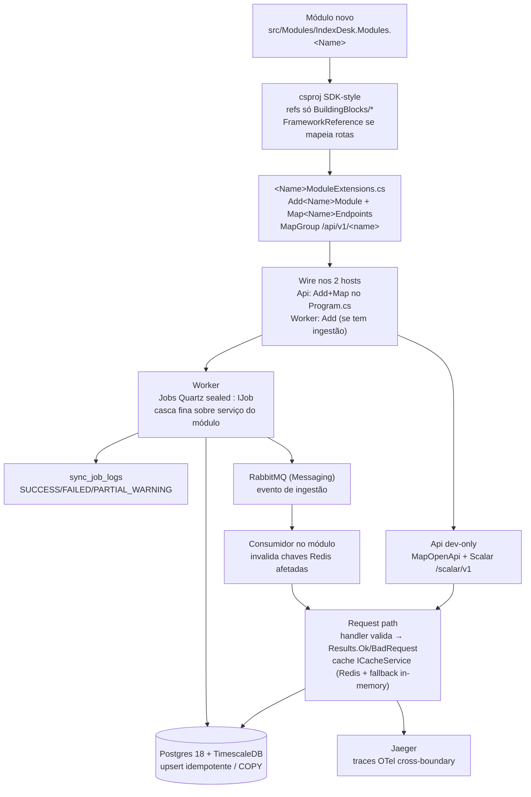

# How-to — Adicionar backend module/route (.NET)

> Guia operacional para criar um **módulo de domínio novo** ou **estender um existente** em
> `apps/backend` (.NET 9 modular monolith). Leia junto com [`feature-development.md`](feature-development.md)
> (ciclo da feature como um todo) e os CLAUDE.md escopados: [`apps/backend/CLAUDE.md`](../../../../apps/backend/CLAUDE.md),
> [`apps/backend/src/CLAUDE.md`](../../../../apps/backend/src/CLAUDE.md),
> [`Modules/IndexDesk.Modules.MarketData/CLAUDE.md`](../../../../apps/backend/src/Modules/IndexDesk.Modules.MarketData/CLAUDE.md)
> e [`IndexDesk.Worker/CLAUDE.md`](../../../../apps/backend/src/IndexDesk.Worker/CLAUDE.md).
> Caso real de referência: o módulo MarketData (cadeia de providers, pool/breaker, NDJSON sidecar,
> jobs de ingestão) — use-o como ilustração pontual, não copie planos antigos.

## Módulo novo vs endpoint no módulo existente

| Situação | O que fazer |
| :--- | :--- |
| Feature pertence a um domínio já mapeado (`Auth`, `MarketData`, `Analytics`, `Portfolio`) | **Não crie módulo novo.** Adicione endpoint/service/calculator no módulo existente |
| Domínio de negócio novo e duradouro (fronteira própria, DI própria, grupo de rotas próprio) | Módulo novo `IndexDesk.Modules.<Name>` seguindo este guia |
| Infra **cross-cutting** sem regra de domínio, reutilizada por ≥2 módulos (ex.: novo transporte, nova store) | Não é módulo — é **Building Block** novo (ver §6) |
| Calculadora/métrica financeira isolada | Endpoint no módulo certo + função pura em `Calculators/` |

Sinais de módulo novo legítimo: tabela(s) própria(s) no schema, agendamento Quartz próprio,
contrato HTTP versionado sob `/api/v1/<name>`, e nome que caberia na lista `Modules/` sem sobrepor vizinhos.

---

## Passo-a-passo (módulo novo)

### Passo 1 — Pasta + csproj

Crie `apps/backend/src/Modules/IndexDesk.Modules.<Name>/` com `IndexDesk.Modules.<Name>.csproj`
(SDK style, espelhe um csproj existente — ex.: `IndexDesk.Modules.Analytics.csproj`):

- **Sem** `TargetFramework`/`Nullable`/`ImplicitUsings`: isso vem global de `Directory.Build.props`
  (`net9.0`, C# 13, `Nullable enable`, `ImplicitUsings enable`, `EnforceCodeStyleInBuild=true`,
  `AnalysisLevel latest-recommended`). Nunca sobrescreva por projeto.
- Referencie **somente** os `BuildingBlocks/*` que o módulo usa (`Common`, `Persistence`, `Cache`,
  `Resilience`, `Messaging`, `Observability`) — nada de referenciar outro `Modules/*`.
- Adicione `<FrameworkReference Include="Microsoft.AspNetCore.App" />` **apenas** se o módulo
  mapeia endpoints (`Map<Name>Endpoints` precisa dos tipos ASP.NET Core). Se for só lógica de
  ingestão consumida pelo Worker, dispensável.
- Opcional: `<InternalsVisibleTo Include="IndexDesk.UnitTests" />` se testes precisam ver tipos internos.
- Registre no solution: `dotnet sln add src/Modules/IndexDesk.Modules.<Name>/IndexDesk.Modules.<Name>.csproj`
  (de dentro de `apps/backend`).

### Passo 2 — As duas extensões (padrão fixo do monólito)

Todo módulo expõe exatamente **duas** extensões estáticas num único arquivo `<Name>ModuleExtensions.cs`
(veja `AnalyticsModuleExtensions.cs`):

```csharp
public static class ExampleModuleExtensions
{
    // Registro de serviços na DI (scoped/query services, clients, validators...)
    public static IServiceCollection AddExampleModule(this IServiceCollection services) { ... }

    // Mapeamento das rotas Minimal API
    public static IEndpointRouteBuilder MapExampleEndpoints(this IEndpointRouteBuilder app) { ... }
}
```

Convenções do `Map*Endpoints`:

- Grupo único: `app.MapGroup("/api/v1/example").WithTags("Example")`.
- Handlers retornam `Results.Ok(...)` / `Results.BadRequest(...)` / `Results.NotFound(...)`;
  erros de negócio viram `{ code, message }` com error codes namespaced (`Example.TickerNotFound`),
  nunca exceção crua no response.
- Validação de entrada inline no handler (ou planner puro chamado por ele): input inválido =
  `Results.BadRequest(new { message = ... })` **antes** de tocar serviço/banco.
- `.WithName(...)` + `.WithSummary(...)` em cada rota — alimenta OpenAPI/Scalar de graça.

### Passo 3 — DTOs, serviços e cálculo

- Requests/responses são **`record`s imutáveis** (`sealed record`), definidos junto às extensões ou
  em `Domain/` (MarketData usa `Domain/` para records normalizados e DTOs de query/health).
- Regra de negócio fica em serviços injetados (`Services/`, `Ingestion/`), não no handler.
- **Toda matemática** (Sharpe, drawdown, Fisher, accrual...) vai em `Calculators/` como funções
  puras estáticas — sem I/O, sem DbContext — para ser unit-testável offline
  (ex.: `PerformanceCalculators`, `FinancialCalculators`).
- Planners/agregações puras extraídos para classe separada quando houver decisão testável
  (ex.: `DailyCloseChain`, `ProviderHealthAggregator` — agregação pura sobre linhas, zero I/O).

### Passo 4 — Registrar nos DOIS hosts

Hosts compõem módulos + building blocks (nunca o contrário):

- `IndexDesk.Api/Program.cs`:
  - `builder.Services.AddExampleModule(builder.Configuration);` junto dos outros `Add*Module`;
  - `app.MapExampleEndpoints();` junto dos outros `Map*Endpoints()`.
  - **Ordem importa**: `AddIndexDeskObservability` primeiro; depois persistence, Redis (com fallback),
    módulos. Não remova `public partial class Program {}` (exigido por `WebApplicationFactory`).
- `IndexDesk.Worker/Program.cs`:
  - `builder.Services.AddExampleModule(builder.Configuration);` se o Worker consome serviços do módulo
    (jobs de ingestão sempre consomem). Mesma ordem: Observability → DbContext → Redis fallback → módulos → Quartz.
- Cache/persistence são injetados por interface (`ICacheService`, `IndexDeskDbContext`) — ambos os hosts
  já registram `RedisCacheService` com fallback in-memory; o módulo nunca faz `new` desses clientes.

### Passo 5 — Testes

- Unit (`tests/IndexDesk.UnitTests`): calculadoras/planners/parsers puros + handlers via mocks leves.
- Integration (`tests/IndexDesk.IntegrationTests`): um teste por grupo de rotas contra
  `WebApplicationFactory<Program>` (ver `ApiEndpointsTests.cs`).
- Gates antes de push: `dotnet build` (analyzers falham build), `dotnet csharpier format .`,
  `dotnet format analyzers` (**nunca** `dotnet format whitespace` — briga com CSharpier), `dotnet test`.

---

## Endpoints — convenções HTTP

- **Minimal APIs agrupadas** sob `/api/v1/<module>` com `WithTags` — sem controllers.
- **OpenAPI**: gerado por `Microsoft.AspNetCore.OpenApi` (`AddOpenApi` + `MapOpenApi()` no Api),
  servido pelo Scalar UI em `/scalar/v1` — **Development only**, sem Swashbuckle. Rota nova com
  `.WithName/.WithSummary` aparece sozinha lá; nada a configurar por módulo.
- **Health**: o health-check do processo é `/health` (host-level). Health **de domínio** segue o
  modelo de providers: `GET /api/v1/providers/health` agrega linhas de `sync_job_logs` +
  snapshot do pool de chaves via agregador puro (`ProviderHealthAggregator`). Se seu módulo tem
  estado operacional observável, exponha `GET /api/v1/<module>/health` no mesmo formato
  (status SUCCESS/FAILED/PARTIAL_WARNING + contadores), alimentado por agregador sem I/O.
- **Cache de leitura**: consultas caras/quentes passam por `ICacheService.GetOrCreateAsync(key, factory, ttl)`
  (Redis com fallback in-memory nos dois hosts). Chaves namespaced (`example:{ticker}:quote`), TTL pela
  tabela DEC-002 (abaixo).
- **Invalidação**: dado atualizado por ingestão publica evento no RabbitMQ (`BuildingBlocks.Messaging`,
  MassTransit); o consumidor invalida **somente as chaves afetadas** no Redis e reaque do Postgres
  (fluxo provider-sync: Worker → Postgres → evento → Analytics invalida/re-warm). Só adicione isso
  quando houver ingestão escrevendo o dado — cache-only estático não precisa.
- **Auditoria de ingestão**: todo job/serviço de sync grava linha em `sync_job_logs`
  (`SyncJobLogEntity`: status SUCCESS/FAILED/PARTIAL_WARNING, processed/updated/skipped, duração).
  É dessa tabela que o `/health` dos providers bebe. Falha ao gravar log = warning, nunca derruba a execução.

---

## Persistência

- Tudo via `BuildingBlocks.Persistence` (`IndexDeskDbContext`, EF Core + Npgsql). Módulo recebe o
  DbContext injetado; não cria conexão própria.
- **Escritas idempotentes obrigatórias**: re-executar job/dia atualiza, nunca duplica. Upsert
  (`ON CONFLICT ... DO UPDATE`) para cargas pequenas; compartilhe upserts reusáveis numa classe única
  do módulo (padrão `IngestionUpserts`).
- **Bulk**: streaming com `NpgsqlBinaryImporter` (COPY binário) linha a linha — arquivos grandes
  (zips CVM, XLSX de gestoras) passam por CsvHelper/ClosedXML **em stream** + filtro antes do COPY;
  nunca carregar arquivo inteiro em RAM (50k+ rows/s sem pico de memória).
- **Hypertables TimescaleDB**: séries temporais têm PK composta com a coluna `date` **sempre** nela —
  `(asset_id, date)` em `asset_quotes`/`fund_daily_reports`; `(series_code, date)` em
  `macro_economic_series`. Explore chunk exclusion nos filtros. Nova série = nova hypertable no DDL
  (`MODELS.md` é a fonte integral; dev local usa `EnsureCreatedAsync` no Api — DDL aditivo manual
  quando o banco já existe, pois EF não migra schema criado).
- Segredos de conexão ficam em `.env` (`ConnectionStrings__*`); `appsettings.json` só defaults de dev.

---

## Quando criar um Building Block novo

Módulo ≠ building block. Building block é infra **sem nenhum conhecimento de domínio**, candidata
quando: (a) ≥2 módulos precisariam duplicar a mesma mecânica (transporte, store, pipeline Polly novo,
barramento), (b) não menciona ETF/ticker/cotação em nenhum tipo público.

1. Crie `src/BuildingBlocks/BuildingBlocks.<Name>/` com `<Name>.csproj` — **zero** referência a `Modules/*`.
2. Exponha `Add<Name>(this IServiceCollection, IConfiguration)` e interfaces públicas; consumidores
   dependem da interface, não da implementação.
3. Chame cedo no `Program.cs` de **ambos** os hosts (sempre depois de `AddIndexDeskObservability`,
   que é invariavelmente o primeiro).
4. Adicione ao `IndexDesk.sln` e aos test projects conforme necessário.

Existem hoje: `Common` (Results/Pagination/Time), `Persistence` (EF+COPY), `Cache` (Redis+fallback),
`Resilience` (Polly pipelines), `Messaging` (MassTransit/RabbitMQ), `Observability` (OTel→Jaeger).
Pool de chaves/breaker **por provider** NÃO virou building block de propósito — acoplamento com
taxonomia de error codes do MarketData; mora no módulo (`Resilience/`).

---

## Fluxograma



---

## Template mínimo

Arquivos a criar para `IndexDesk.Modules.<Name>`:

```text
apps/backend/src/Modules/IndexDesk.Modules.<Name>/
├── IndexDesk.Modules.<Name>.csproj      # SDK style, refs BuildingBlocks escolhidos
├── <Name>ModuleExtensions.cs            # as DUAS extensões + DTOs record
├── Services/                            # leitura/query (opcional no início)
├── Ingestion/                           # só se tiver ingestão (serviços p/ jobs)
├── Domain/                              # records normalizados (opcional)
└── Calculators/                         # matemática pura, sem I/O (opcional)
# editar: IndexDesk.sln (+dotnet sln add), Program.cs do Api E do Worker,
# tests/IndexDesk.UnitTests + tests/IndexDesk.IntegrationTests
```

`IndexDesk.Modules.<Name>.csproj`:

```xml
<Project Sdk="Microsoft.NET.Sdk">
  <PropertyGroup>
    <RootNamespace>IndexDesk.Modules.<Name></RootNamespace>
  </PropertyGroup>

  <!-- Só se o módulo mapeia endpoints (Map<Name>Endpoints) -->
  <ItemGroup>
    <FrameworkReference Include="Microsoft.AspNetCore.App" />
  </ItemGroup>

  <!-- Referencie APENAS os blocks que o módulo usa -->
  <ItemGroup>
    <ProjectReference Include="..\..\BuildingBlocks\BuildingBlocks.Common\BuildingBlocks.Common.csproj" />
  </ItemGroup>
</Project>
```

`<Name>ModuleExtensions.cs` (extensões vazias + GET de exemplo):

```csharp
using Microsoft.AspNetCore.Builder;
using Microsoft.AspNetCore.Http;
using Microsoft.AspNetCore.Routing;
using Microsoft.Extensions.DependencyInjection;

namespace IndexDesk.Modules.<Name>;

public static class <Name>ModuleExtensions
{
    public static IServiceCollection Add<Name>Module(this IServiceCollection services)
    {
        // services.AddScoped<I<Name>Service, <Name>Service>();
        return services;
    }

    public static IEndpointRouteBuilder Map<Name>Endpoints(this IEndpointRouteBuilder app)
    {
        var group = app.MapGroup("/api/v1/<name>").WithTags("<Name>");

        group.MapGet("/{ticker}", (string ticker) =>
            {
                if (string.IsNullOrWhiteSpace(ticker))
                    return Results.BadRequest(new { message = "Ticker obrigatório." });

                // chame o serviço aqui; math em Calculators/
                return Results.Ok(new <Name>QuoteResponse(ticker.ToUpperInvariant()));
            })
            .WithName("Get<Name>Quote")
            .WithSummary("Exemplo de leitura do módulo");

        return app;
    }
}

public sealed record <Name>QuoteResponse(string Ticker);
```

Wire nos hosts:

```csharp
// IndexDesk.Api/Program.cs (e Worker, se o Worker consome)
builder.Services.Add<Name>Module(builder.Configuration);   // junto dos outros Add*Module
// ...
app.Map<Name>Endpoints();                                   // junto dos outros Map*Endpoints
```

---

## Se o módulo for de ingestão — local-first (NON-NEGOTIABLE)

- **Nenhuma requisição de usuário chama provedor externo.** Clientes HTTP/sidecar de provider são
  acessados **somente** por serviços do módulo chamados por jobs do `IndexDesk.Worker`. O request path
  (Api) lê Postgres/Redis apenas. Endpoints REST de gatilho manual (`POST /sync/...`) existem como
  caminho operacional legado — não é o fluxo principal.
- Job Quartz segue o padrão do Worker **exatamente** (`IndexDesk.Worker/CLAUDE.md`):
  1. `Jobs/<Nome>SyncJob.cs`: `sealed`, `IJob`, `[DisallowConcurrentExecution]`.
  2. Construtor injeta **o serviço do módulo** + `ILogger` — job é casca fina; regra de negócio,
     acesso a provider e COPY vivem no módulo (`Ingestion/`), nunca no job.
  3. `Execute` repassa `context.CancellationToken`; loga pelo padrão `Result` (sucesso = resumo
     linhas/duração/status; falha = `LogError`). Falha de uma fonte **não interrompe as demais** —
     degrada pra PARTIAL_WARNING e o job segue.
  4. Registra JobKey + trigger cron em UTC no `Program.cs` do Worker (grupo próprio, ex.
     `<Name>Ingest`); job manual/backfill: `.StoreDurably()` sem trigger.
  5. Serviço grava `sync_job_logs` (status + processed/updated/skipped + duração).
  6. Idempotência: reexecutar o mesmo dia atualiza (upsert/COPY), nunca duplica.
- Resiliência por provider (pool de chaves p/ limite por chave, espaçamento fixo p/ limite por IP,
  breaker com códigos soft `Provider.CircuitOpen`/`Provider.PoolExhausted`) mora no módulo — veja o
  padrão `Resilience/` do MarketData antes de inventar estrutura paralela.
- **TTLs de cache após ingestão (DEC-002)**: histórico fechado **30 dias** (passado imutável pode ser
  infinito) · intraday/do dia vigente **15 min** · macro (CDI/Selic/IPCA/feriados) **24 h** ·
  holdings/gestoras **7 dias**. Invalidação orientada a evento, somente chaves afetadas.
- Segredos: `.env` via `Providers__*`; nunca valor de chave/token/cookie em log/span (pool expõe
  índice `#{Index}` no máximo).
- Fechamento: atualize `PROVIDERS.md` (fonte nova/removida), tabela de jobs no CLAUDE.md do Worker,
  e a skill (`current-features.md`, `common-mistakes.md`, `decisions-risks.md`, `project-state.md`)
  — faz parte do definition of done.
