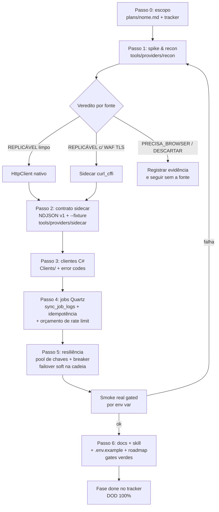

# How-to — Desenvolvimento de feature no IndexDesk

> Guia operacional para implementar features neste repo, usando como estudo de caso a iniciativa
> **provider-sync** (`plans/provider-sync-scrapers.md`, Fases 0–5): agregadores (Brapi/Yahoo/TradingView),
> sync jobs Quartz, sidecar Python (yfinance/tv-scraper, contrato NDJSON), scraping com recon/HAR,
> pool de chaves + circuit breaker, holdings multisource e câmbios. Leia junto com
> [`../references/process/common-mistakes.md`](../references/process/common-mistakes.md) antes de cada commit.

## Quando criar um plano próprio vs só uma task de roadmap

| Situação | Onde registrar |
| :--- | :--- |
| Escopo cabe numa task da fase (ex.: MVP-xxx), um host, uma sessão | Task no `.roadmap/**/*.json` apenas |
| Feature multi-fase com dependências entre etapas, incerteza externa (provedor, WAF, rate limit), mais de um runtime (C# + Python), precisa de tracker entre sessões/subagentes | **Plano standalone em `plans/<nome>.md`** + referência no roadmap |

Sinais de que precisa de plano próprio:

- Você vai **medir coisas desconhecidas antes de codar** (limite real do provider free, se o WAF deixa passar, tamanho máximo de payload). No caso provider-sync, o recon descobriu que o login da lib TV era por **cookie** (não email/senha) e que Brapi anônimo é whitelist-only — o plano absorveu esses desvios sem reescrever o roadmap.
- Fases têm **dependência dura** (contrato do sidecar só congela depois do spike; clientes C# só depois do contrato; resiliência integra com os jobs já criados).
- O trabalho será fatiado em sessões/subagentes e alguém precisa retomar de onde parou — o plano é o **registro de progresso**, com status por fase e "Registro do que foi feito".
- Decisões de implementação merecem ID próprio (padrão: namespace dedicado, ex. `DEC-PS-*`, para não colidir com as `DEC-*` numeradas do roadmap) e vão também para [`../references/process/decisions-risks.md`](../references/process/decisions-risks.md).

Plano não substitui roadmap: tarefas de produto continuam nas fases `.roadmap/**`; o plano documenta **como** a iniciativa foi/executa.

---

## O ciclo em 7 passos

### Passo 0 — Escopo & localização do plano

**Saída:** esqueleto do plano em `plans/<nome>.md`: objetivo, decisões locked no topo, arquitetura-alvo, tabela tracker (fase · status · dependências · datas), fases com tarefas/DOD/registro, riscos/mitigações, fora de escopo.

- Iniciativa multi-fase → `plans/`. Mudança pontual de produto → só `.roadmap/**/*.json` (+ `roadmap:validate`/`generate`). Nunca editar `ROADMAP.md` à mão.
- Travar no topo do plano as **decisões já fechadas** (ex.: "sidecar Python desde o início", "fonte X fora da cadeia por ser paga") — evita relitigar a cada fase.
- Definir **fora de escopo** explícito (no caso de estudo: Google Finance, streaming intraday).

### Passo 1 — Spike & recon (headless)

**Saída:** evidência medida de cada fonte, classificada com veredito; HARs versionados; spec dos futuros clients.

Onde mora: `tools/providers/recon/` (`recon.md` com hosts/params/headers por fonte; `hars/` com capturas gzip, date-suffixed, **keys redacted**).

Procedimento:

1. Rodar os CLIs/libs candidatas contra símbolos reais e **anotar números**: versões pinadas que funcionaram, req/min até o 429, cap prático de bars, latência.
2. Capturar tráfego das páginas-alvo com Playwright (**headed sob `xvfb-run`** — vários sites bloqueiam headless por User-Agent) e salvar HAR.
3. Tentar **replay** de cada endpoint via `curl_cffi` (`impersonate="chrome"`).
4. Classificar cada fonte com evidência:
   - `REPLICÁVEL` — endpoint limpo, replay 200 (ex.: InfoMoney APIM, XP wp-json);
   - `PRECISA_BROWSER` — SPA sem endpoints no HTML estático (na prática: descartar, ex.: Invesco);
   - `DESCARTAR` — sem endpoint viável ou dado redundante (ex.: Investing.com feed).
5. A spec resultante alimenta o Passo 2/3 — nada de client escrito sobre suposição.

Pitfalls desta etapa (ver `common-mistakes.md`):

- ❌ Contornar WAF Akamai spoofando User-Agent/headers no HttpClient/curl nativo → ✅ Akamai valida **fingerprint TLS (JA3)**: 403 mesmo com headers completos de browser. Só o transporte sidecar (`curl_cffi`) passa.
- ❌ Assumir que o domínio apex existe → ✅ `itnow.com.br` dá NXDOMAIN; host real `www.itnow.com.br`. Validar DNS/host no spike.
- ❌ Assumir cobertura do plano free → ✅ Brapi anônimo é whitelist-only (só PETR4/VALE3, resto 401 `MISSING_TOKEN`) e o batch ignora o filtro `tickers` — medir antes, calibrar fila depois.
- ❌ Hardcodar id/hash de URL rotativa (iShares `.ajax?fileType=csv`) → ✅ extrair o link da página do produto por regex, mapa ticker→página em config.

### Passo 2 — Contrato do sidecar

**Saída:** CLI Python com contrato versionado e testável **sem rede**.

Onde mora: `tools/providers/sidecar/` (projeto `uv`, deps pinadas exatas no `pyproject.toml`; `src/sidecar/` + `tests/`).

Regras do contrato (v1, vigente):

- **stdout = NDJSON puro** — `{ticker,date,open,high,low,close,adj_close,volume}` / `{ticker,date,rate,type}`. Qualquer linha extra quebra o parser C# com `Sidecar.ParseError`.
- **stderr = logs e erro** — envelope `{"error":{"code":...}}`.
- Exit codes: `0` ok · `2` usage · `3` fetch · `4` parse.
- Flag `--fixture arquivo` emite NDJSON pronto → consumo/teste offline (roundtrip deve ser byte-a-byte).
- Comando genérico `fetch` (`--url/--method/--data/--header/--b64`) = transporte anti-WAF reutilizável para qualquer fonte `REPLICÁVEL via curl_cffi` — não crie um comando Python novo por fonte.
- Payloads flaky (TV ≥4500 bars) → chunking + retry + dedupe dentro do sidecar, não no chamador.

Pitfall: ❌ escrever log/print no stdout ("só um a mais") → ✅ todo erro no stderr como JSON. E ❌ congelar o CLI antes do spike → ✅ o contrato real divergiu do assumido (tv-scraper autentica por `--cookie`, sem email/senha); o spike do Passo 1 é quem valida o desenho.

### Passo 3 — Clientes C#

**Saída:** clients tipados integrados ao módulo, cobertos por testes offline, pipeline existente intacto.

Onde mora: `Modules/IndexDesk.Modules.MarketData/Clients/`.

- `SidecarProcessRunner`: spawn do `uv` via `ArgumentList`, timeout configurável (`Providers__Sidecar__TimeoutSeconds`, default 120 s) com `Kill(entireProcessTree: true)`, tail de stderr truncado, extração do envelope de erro, mapeamento exit 2/3/4 → `Sidecar.Usage/FetchFailed/ParseError`; spawn falho → `Sidecar.SpawnFailed`. Singleton no DI.
- Um client por fonte, implementando a interface da cadeia (`IMarketDataClient`) com `ProviderName` + `Priority`; símbolos no formato do provider (ex.: `PETR4.SA` no Yahoo, prefixo `BMFBOVESPA:` na TV — ticker bare falha).
- **Error codes distintos e tipados** por modo de falha (`Sidecar.*`, `Scrape.WafBlocked`, `TradingView.AuthFailed`, `*.NoApiKey`...) — eles são a matéria-prima da resiliência do Passo 5.
- Fonte recon-classificada como replicável entra aqui como **secundária** (fora da cadeia declarativa até decidir slots no Passo 4).
- Testes: unitários contra fixtures NDJSON e scripts fake no lugar do binário (mapeamento de símbolo/argv, parse quebrado, timeout, env forwarding). Smoke real de rede fica gated por env var.

Pitfalls: ❌ logar os argumentos do runner → ✅ cookie TV vai no argv do filho e key InfoMoney no env do filho — logue só executável/timeout (segredo no log = vazamento). ❌ Assumir que `bash -c <script>` lê arquivo nos testes fake → ✅ use `exec bash '<path>' "$@"`; e kill de timeout tem que ser da árvore inteira (filhos sobrevivem ao kill simples).

### Passo 4 — Jobs & scheduling

**Saída:** ingestão agendada no Quartz, auditada em `sync_job_logs`, idempotente, com orçamento de rate limit.

Onde mora: casca fina em `IndexDesk.Worker/Jobs/`; toda a lógica em `Modules/IndexDesk.Modules.MarketData/Ingestion/`.

Padrão do job (seguir o `CLAUDE.md` do Worker exatamente):

1. `Jobs/<Nome>SyncJob.cs`: `sealed`, `IJob`, `[DisallowConcurrentExecution]`; construtor injeta **o serviço do módulo** + logger; `Execute` repassa `context.CancellationToken`.
2. Registrar JobKey + trigger cron em **UTC**, grupo `MarketDataIngest`; job manual/backfill: `.StoreDurably()` sem trigger. Backfill on-demand via CLI (`--backfill TICKER [--provider ...]`), encerrando antes de subir schedulers.
3. Toda execução grava `sync_job_logs` (`SyncJobLogEntity`: SUCCESS/FAILED/PARTIAL_WARNING + processed/updated/skipped + duração). Falha de um provider = PARTIAL_WARNING isolado; **nunca** derruba os demais nem o job.
4. Idempotência obrigatória: upsert/COPY; reiniciar backfill no meio é seguro.
5. Orçamento por provider definido aqui (ou no serviço): UMA chamada batch/dia útil para o agregador apertado (Brapi `/quote/list`), fila espaçada por ticker (≥7 s, `DividendQueue` com delay injetável), bulk history nunca pela fonte carregada.
6. Dado novo precisa de casa no schema: contratos FX (bid/ask, sem OHLCV) vão em `fx_rates` (PK pair+date), não em `macro_economic_series`; holdings em `etf_holdings` com dedupe consciente (`holding_ticker` nullable → linhas sem ticker dedupe por nome).

Pitfalls: ❌ 1 req por ticker no fluxo diário → ✅ batch único + fila espaçada. ❌ Esperar que `EnsureCreated` adicione tabelas num banco existente → ✅ EF não migra DB criado; DDL aditivo manual/migration antes de rodar o sync. ❌ Parser assumindo layout teórico da gestora → ✅ layouts reais surpreendem (coluna sem ticker, peso pt-BR com vírgula já são pontos percentuais, SSGA case-sensitive com ticker minúsculo); parser tolerante + fixtures do layout real + regressão.

### Passo 5 — Resiliência (pool + breaker)

**Saída:** sistema que sobrevive a 429, bloqueio TLS e queda de provider sem erro duro nem dado furado.

Onde mora: pipelines genéricos em `BuildingBlocks.Resilience/`; pool/breaker específicos de provider em `Modules/IndexDesk.Modules.MarketData/Resilience/`; knobs em `Providers:Resilience:*`.

- **Pool de chaves** (`IApiKeyPool`/`InMemoryApiKeyPool`, singleton thread-safe): round-robin entre chaves saudáveis; cooldown após 429/quota honrando `Retry-After` (quota diária dorme até próximo dia UTC); chave `Invalid` (401/403) sai da rotação até reinício; token bucket por chave vive **dentro** do pool (`Acquire` consome token). Aplica-se só a limite **por chave** (Brapi/AwesomeApi/InfoMoney). Config via arrays nativos (`Providers__Brapi__ApiKeys__0=...`); provider sem chaves roda keyless.
- **Limite por IP** (Yahoo/TV): pool não ajuda — vale espaçamento fixo entre chamadas + breaker.
- **Breaker por provider** (`ProviderResilience` + `ResiliencePipelines.CreateProviderCallPipeline<T>`): estado por nome de provider em singleton (clients transient não perdem histórico); circuito aberto e pool esgotado respondem códigos **soft** (`Provider.CircuitOpen`/`Provider.PoolExhausted`) que viram PARTIAL_WARNING e disparam failover pro próximo slot da cadeia — retry cego na mesma fonte nunca.
- **Taxonomia de error codes define retry×breaker**: `.RateLimit` = retry sim/breaker não (cooldown do pool é dono desse modo de falha) · `Scrape.WafBlocked`/`*.AuthFailed` = breaker sim/retry não · `Sidecar.Timeout/FetchFailed/.HttpError/.Exception` = ambos · pass-through: `*.NoApiKey/.NoData/PoolExhausted/ParseError/Usage/SpawnFailed`.
- Clock injetável (`TimeProvider`) → testes determinísticos sem sleep; planners puros (cadeia/fila) extraídos para teste offline.

Pitfall: ❌ tratar "rate limit" como um modo único → ✅ distinguir por-chave (rotaciona/esgota) de por-IP (espaça/quebra circuito), e soft (`PARTIAL_WARNING` + failover) de duro (`FAILED`).

### Passo 6 — Docs, skill e roadmap (fechamento)

**Saída:** documentação, skill interna e roadmap sincronizados com o código entregue. Faz parte do definition of done — não é opcional.

- `PROVIDERS.md`: nova fonte = seção própria (contrato, rate limit, papel na cadeia); removida = linha atualizada.
- `apps/backend/src/IndexDesk.Worker/CLAUDE.md`: tabela de jobs + regras novas de resiliência.
- Skill indexdesk: [`current-features.md`](../references/process/current-features.md) (inventário), [`common-mistakes.md`](../references/process/common-mistakes.md) (pitfalls descobertos na execução), [`decisions-risks.md`](../references/process/decisions-risks.md) (DECs da iniciativa), [`project-state.md`](../references/process/project-state.md) (snapshot).
- `.env.example` reconciliado com o que o código **realmente lê** (grep das options classes — nomes errados silenciam config; segredos vazios).
- Roadmap: `bun run roadmap:validate` → `roadmap:generate` → `roadmap:check` verdes; status final do plano preenchido.
- Gates finais: `dotnet build` (Debug e Release), `dotnet csharpier check .`, `dotnet format analyzers`, suítes de teste verdes.

---

## Modelo de checklist DOD por fase

Cada fase do plano usa três blocos + o tracker global. Regras:

- Marque `- [x]` conforme execução; itens parciais recebem itálico explicando o que falta.
- **Uma fase só é `done` quando TODOS os itens do DOD estão cumpridos** — tarefa marcada ≠ DOD cumprido (no estudo de caso, a Fase 3 só fechou após o wire smoke real do It Now via transporte sidecar).
- Preencha sempre o **"Registro do que foi feito"**: decisões tomadas, números medidos, desvios do plano, data. Adendos posteriores entram datados, sem reescrever o original.
- Respeite a ordem de dependências (0→1→2→3; resiliência integra com jobs; fechamento depende de tudo). Nada de implementação fora do escopo das fases — desvio legítimo entra como item marcado + nota de desvio.

```markdown
## Tracker de progresso

| Fase | Nome                          | Status        | Dependências | Início     | Concluída em |
| :--- | :---                          | :---          | :---         | :---       | :---         |
| 0    | Spike (~meio dia)             | ⏸️ blocked (...) | —            | 2026-08-23 | —            |
| 1    | Contrato sidecar              | ✅ done       | 0            | 2026-08-23 | 2026-08-23   |
| 2    | Clientes C#                   | ✅ done       | 1 (+spec 0.5)| 2026-08-23 | 2026-08-23   |
| 3    | Jobs & scheduling             | 🔵 in_progress| 2            | 2026-08-23 | —            |

Legenda: ⬜ not_started · 🔵 in_progress · ✅ done · ⏸️ paused/blocked

### Fase N — <nome>

**Objetivo:** ...

**Tarefas**
- [x] ...
- [ ] ...(nota do que falta)

**DOD (definition of done)**
- [x] Critério verificável ...
- [ ] ...

**Registro do que foi feito**
- Executado <data>; números medidos; desvios; pendências.
```

Boas práticas de DOD: critérios **verificáveis** ("limite real documentado em req/min", "smoke `--backfill TICKER` idempotente na 2ª execução", "nenhuma chave em log/span — grep = 0"), nunca "código pronto". Bloqueio ambiental (credencial ausente, DNS geo-bloqueado) vira fase ⏸️ com o motivo explícito no tracker, e o resto segue.

---

## Modo sidecar: quando Python vs HttpClient nativo

Decisão por fonte, guiada pelo veredito do recon:

| Cenário | Transporte | Exemplo real |
| :--- | :--- | :--- |
| Endpoint público limpo, sem WAF, JSON/CSV/XLSX simples | **HttpClient nativo** no módulo (parsers puros testáveis) | AwesomeAPI (`fx_rates`), BCB SGS, iShares CSV (CsvHelper), SPDR XLSX (ClosedXML) |
| TLS fingerprinting / challenge (403 mesmo com headers de browser), ou lib anti-bloqueio pronta (yfinance, tv-scraper) | **Sidecar** (`curl_cffi impersonate=chrome`) | Yahoo, TradingView, InfoMoney, XP, It Now (`Transport=sidecar`) |
| SPA shell sem endpoint acessível (`PRECISA_BROWSER`) | **Descartar** — browser headless em produção é custo alto, só se o dado valer | Invesco |

Mapa de onde vive cada peça:

- **Recon** (HARs, spec, vereditos): `tools/providers/recon/` — insumo, não runtime.
- **Runtime Python**: `tools/providers/sidecar/` — transporta e normaliza em NDJSON; **nada de regra de negócio** lá.
- **Runner + transporte genérico**: `SidecarProcessRunner` (spawn/timeout/parse) e `ISidecarHttp`/`SidecarHttp` (empacota o comando `sidecar fetch`) em `Clients/` — nova fonte WAF'd geralmente não precisa de código Python novo, só apontar o `fetch` pra URL certa.
- **Parsers/normalização/upsert**: C# no módulo (`Ingestion/`), puros e fixture-testados — o sidecar só transporta (DEC-PS-01/05).

Segredos no caminho: cookie/key chegam ao filho por **argv/env do processo**, lidos de `.env` (`Providers__*`); nunca em appsettings commitado, log, span OTel ou documento.

---

## Fluxograma do ciclo



Loop de volta ao recon é esperado: fonte quebra (WAF aperta, layout muda) → re-recon → ajuste de contrato/parser → regressão com fixture nova.

---

## Dicas de execução

### Validar sem rede

- Sidecar: `--fixture arquivo` emite NDJSON pronto; suíte pytest roda offline com transporte falso. Roundtrip fixture = byte-a-byte.
- C#: nos testes, troque o binário do runner por script fake (mesma interface de argv/stdout/exit code); parsers puros consumem fixtures versionadas (`tests/IndexDesk.UnitTests/Fixtures/...`); delays injetáveis (`DividendQueue`, `FakeTimeProvider`) eliminam sleeps.
- Smoke de rede real existe, mas **sempre gated por env var** (`SIDECAR_SMOKE=1`, `HOLDINGS_SMOKE=1`) — skip automático fora de smoke; CI nunca bate em provider.
- Descobertas de smoke viram correção + **teste de regressão** com fixture do caso real (peso pt-BR "1,32", link ajax relativo, ticker minúsculo SSGA).

### Isolamento de testes

- Unit = lógica pura (planners, pools com clock fake, parsers); Integration = `WebApplicationFactory` contra o Api; rede só em smoke gated.
- Estado de breaker/pool em singletons nomeados por provider mantém testes independentes entre si.
- Gates por fase: `dotnet build IndexDesk.sln` (0 erros) · `dotnet csharpier check .` · `dotnet format analyzers` · `dotnet test` · pytest do sidecar. Não rodar `dotnet format whitespace` (disputa whitespace com CSharpier) nem `dotnet build -c Release` com watch ligado.

### Segredos

- **Logar índice, nunca valor**: pool expõe `#{Index}` + contadores; snapshot de saúde carrega índice/apenas contadores. Auditoria de fim de fase: grep por padrão de segredo em logs/HARs/docs = 0 matches.
- Cookie TV no argv do filho, key InfoMoney no env do filho, tokens como query param só em runtime — nunca em appsettings commitado, nunca em span OTel.
- `.env` com mode 600 e gitignored; HARs versionados somente com keys redacted; `.env.example` reconciliado com chaves vazias.

### `plans/` vs `.roadmap/`

- `.roadmap/**/*.json` = fonte do `ROADMAP.md` **gerado** (fases/tasks de produto, DEC/RISK numerados). Editar JSON → `roadmap:validate` → `roadmap:generate`. Editar `ROADMAP.md` direto é erro.
- `plans/<iniciativa>.md` = registro vivo de execução (tracker, DOD, registros datados, adendos). Referencie-o do roadmap/task quando a task depender dele; ao fechar, status final por fase + DECs de implementação espelhadas em [`../references/process/decisions-risks.md`](../references/process/decisions-risks.md) com namespace próprio.
