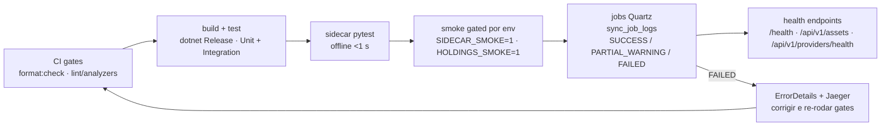

# How-to — Validação, quality gates e jobs de ingestão

> Guia operacional de como **validar este repo** e de como **integrar um novo job de ingestão externa**
> conservando o local-first. Fundamentado na iniciativa provider-sync
> ([`plans/provider-sync-scrapers.md`](../../../plans/provider-sync-scrapers.md)): recon headless →
> sidecar Python → pool de chaves + breaker → jobs Quartz → auditoria em `sync_job_logs`.
> Leia junto com [`feature-development.md`](feature-development.md) (ciclo de implementação) e
> [`../references/process/conventions.md`](../references/process/conventions.md).

---

## 1. Validar o repositório — comandos reais

### De onde rodar

A **raiz do repo via Turborepo é o ponto de entrada único** (orquestra `apps/web` Next.js +
`apps/backend` .NET num só grafo de tarefas e cache). `cd apps/backend` só para comandos dotnet que o
turbo não expõe (watch de um host, filtro de suíte, formatter pontual). Nunca npm/yarn/pnpm.

```bash
# Da raiz (preferido):
bun run dev              # next dev + dotnet watch (worker/api)
bun run build            # next build + dotnet build -c Release
bun run lint             # oxlint (web) + dotnet format analyzers (backend)
bun run typecheck        # tsc (web) + analyzers/build .NET
bun run test             # vitest (web) + dotnet test (backend)
bun run format           # oxfmt + dotnet csharpier format
bun run format:check     # gate CI: oxfmt --check + csharpier check
bun run roadmap:validate # ou roadmap:generate / roadmap:check

# Backend-only (cd apps/backend):
dotnet build -c Release
dotnet watch --project src/IndexDesk.Api      # hot-reload da Api
dotnet watch --project src/IndexDesk.Worker   # hot-reload do Worker
dotnet test                                   # Unit + Integration
dotnet test tests/IndexDesk.UnitTests         # suíte única
dotnet csharpier check .
dotnet format analyzers                       # style + analyzers (NUNCA whitespace)
```

O sidecar Python **não é task turbo** — rodar na pasta dele:

```bash
cd tools/providers/sidecar
uv sync && uv run pytest    # suíte inteira offline, <1 s
```

### CSharpier vs `dotnet format` (divisão rígida)

Os dois convivem com divisão de trabalho exata — misturar gera briga de formatter:

| Ferramenta | Dona de | Comandos |
| :--- | :--- | :--- |
| **CSharpier** (tool manifest `.config/dotnet-tools.json`) | **apenas whitespace/layout** | `dotnet csharpier format .` · `dotnet csharpier check .` |
| **`dotnet format style` + `analyzers`** | estilo + regras de analizador (`.editorconfig`, SDK) | `dotnet format style` · `dotnet format analyzers` |

- ❌ **Nunca** `dotnet format whitespace` — disputa whitespace com o CSharpier (CSharpier ganha).
- `EnforceCodeStyleInBuild=true` (em `Directory.Build.props`) faz violação de analyzer **falhar o
  build** — não adie correção de estilo pro fim.
- Falso-positivo conhecido: `dotnet format analyzers --verify-no-changes` pode falhar por advisories
  **NuGetAudit pré-existentes** (ex.: AngleSharp 1.2.0, exporter OTel) — leia a mensagem: advisory de
  dependência ≠ violação de estilo.

### Interpretar o cache do Turborepo (`turbo.json`)

- `build` cacheia outputs `.next/**` e **`**/bin/**` + `**/obj/**`** — cache hit ("cache hit,
  replaying logs") pula o `dotnet build` inteiro e repete o log anterior; é confiável enquanto os
  inputs não mudarem.
- `test` tem `dependsOn: ["build"]` e cacheia `coverage/**` + `TestResults/**` — testes nunca rodam
  sobre build velho.
- `dev` é `persistent` e sem cache; `format`/`clean` sem cache; `format:check` roda sempre (inputs
  amplos incluem `*.md`).
- `globalDependencies`: `**/.env`, `tsconfig.json`, `Directory.Build.props`, `.editorconfig`
  (+ `globalEnv` `DOTNET_ENVIRONMENT` etc.) — **editar qualquer um invalida todos os caches do
  backend**. "Build de repente demorando" quase sempre é isso, não cache quebrado.
- Para forçar reconstrução: `bun run clean` ou apagar `bin/`/`obj/`.
- Quirk local: `DOTNET_SYSTEM_GLOBALIZATION_INVARIANT=1` já está em `globalPassThroughEnv` (libicu
  ausente sem sudo).

### Tabela de gates (equivalente de CI)

| Gate | Comando | Escopo | Falha quando |
| :--- | :--- | :--- | :--- |
| Formatação | `bun run format:check` (`oxfmt --check` + `csharpier check`) | web + C# | qualquer diff de formatação |
| Lint/analyzers | `bun run lint` (`oxlint` + `dotnet format analyzers`) | web + C# | violação de preset TS/React/Next ou regra `.editorconfig` |
| Build | `bun run build` (`next build` + `dotnet build -c Release`) | tudo | erro de compilação/analyzer (`EnforceCodeStyleInBuild`) |
| Testes .NET | `bun run test` (`dotnet test`: Unit + Integration) | backend | teste vermelho |
| Testes sidecar | `uv run pytest` (em `tools/providers/sidecar`) | Python | teste vermelho (suíte offline) |
| Roadmap | `bun run roadmap:check` | `.roadmap/**/*.json` | `ROADMAP.md` gerado diverge dos JSON |

Ordem local antes de push: `format:check` → `lint` → `typecheck`/`build` → `test` → `pytest` →
`roadmap:check`.

---

## 2. Integrar novo job de ingestão externa (local-first intacto)

Regra NON-NEGOTIABLE: **nenhum request de usuário chama provider externo**. Provider é lido somente
por job Quartz do `IndexDesk.Worker`; o dado chega ao usuário via Postgres/Redis locais.

### a) Onde vive cada peça

| Peça | Caminho | Papel |
| :--- | :--- | :--- |
| Recon/HARs (insumo, não runtime) | `tools/providers/recon/` | spec da fonte: hosts, headers, veredito replicável/precisa-browser/descartar |
| Sidecar Python | `tools/providers/sidecar/` | transporte anti-bloqueio (`yfinance`, `tv-scraper`, `curl_cffi`) + comando genérico `fetch`; emite NDJSON; **zero regra de negócio** |
| Runner + transporte | `Modules/IndexDesk.Modules.MarketData/Clients/` (`SidecarProcessRunner`, `ISidecarHttp`) | spawn uv com timeout, parse NDJSON, envelopes de erro |
| Client do provider | mesmo `Clients/` (`BrapiClient` nativo · `YfinanceSidecarClient` etc.) | implementa `IMarketDataClient` (`ProviderName`, `Priority`) ou client dedicado |
| Pool/breaker específico | `Modules/…MarketData/Resilience/` | `IApiKeyPool`/`InMemoryApiKeyPool`, `ProviderResilience` |
| Serviço de sync | `Modules/…MarketData/Ingestion/` | orquestra, aplica orçamento, upsert idempotente, grava `sync_job_logs` |
| Job Quartz | `IndexDesk.Worker/Jobs/` | **casca fina**: agenda, repassa `CancellationToken`, loga `Result` |

Escolha do transporte por fonte (veredito do recon decide):

| Cenário | Transporte | Exemplo |
| :--- | :--- | :--- |
| Endpoint público limpo, JSON/CSV/XLSX simples | **HttpClient nativo** no módulo | AwesomeAPI, BCB SGS, iShares CSV, SPDR XLSX |
| TLS fingerprinting/challenge (403 mesmo com headers de browser) ou lib anti-bloqueio pronta | **Sidecar** (`curl_cffi impersonate=chrome`) | Yahoo, TradingView, InfoMoney, It Now (`Transport=sidecar`) |
| SPA sem endpoint acessível | **Descartar** a fonte | Invesco |

### b) Resiliência: onde vai o quê

- **Genérico sem domínio** → `BuildingBlocks.Resilience`: pipelines Polly fábricas
  (`ResiliencePipelines.CreateProviderCallPipeline<T>`), `ProviderCallException`. Nenhum nome de
  provider aqui — building block não conhece domínio.
- **Específico de provider** → `Resilience/` do módulo MarketData:
  - `IApiKeyPool`/`InMemoryApiKeyPool` (singleton thread-safe): round-robin entre chaves saudáveis,
    cooldown pós-429 honrando `Retry-After` (quota diária dorme até próximo dia UTC), chave `Invalid`
    (401/403) fora da rotação até reinício, **token bucket dentro do pool** (`Acquire` consome token;
    Brapi 10 req/min/chave). Só se aplica a limite **por chave** (Brapi/AwesomeAPI/InfoMoney);
    Yahoo/TV são **por IP** — lá vale espaçamento fixo (200 ms no DailyClose) + breaker.
  - `ProviderResilience` (singleton): breaker por **nome** de provider, pipelines cacheadas por
    `(provider, tipo, modo)` — clients transient não perdem estado. Knobs em `Providers:Resilience:*`.
- Config de chaves via arrays nativos (`Providers__Brapi__ApiKeys__0..N`) vindos de `.env`; provider
  sem chaves roda keyless.

Taxonomia de error codes define retry × breaker (assertar em teste):

| Código | Retry | Conta breaker |
| :--- | :--- | :--- |
| `*.RateLimit` | sim (pool rotaciona) | não (cooldown do pool é dono do modo) |
| `Scrape.WafBlocked`, `*.AuthFailed` | não | sim |
| `Sidecar.Timeout/FetchFailed`, `*.HttpError/.Exception` | sim | sim (sidecar: 1 retry só nesses) |
| `*.NoApiKey/.NoData`, `Provider.PoolExhausted`, `Sidecar.ParseError/Usage/SpawnFailed` | pass-through | pass-through |

### c) Orçamento de rate limit — orquestrado no serviço, nunca no job

Padrões reais a copiar:

- **DailyClose** (`MarketDataDailySyncJob`, 22:00 UTC MON–FRI): **UMA chamada batch** Brapi
  (`/quote/list`) por dia útil; proventos numa fila espaçada (`DividendQueue`,
  `Providers:Brapi:DividendSpacingMs`, default **7000 ms**, delay após cada ticker incluindo o
  último); gap fill Yahoo/TV sidecar com espaçamento fixo 200 ms; **bulk history nunca no Brapi** —
  esse papel é do Yahoo sidecar.
- **FX separada** (`FxRatesDailySyncJob`, 22:05 UTC): serviço, tabela (`fx_rates`) e linha de
  `sync_job_logs` próprias; falha isolada. Não acople ao daily close só porque o horário é próximo.
- **HoldingsWeekly** (`HoldingsWeeklySyncJob`, **sábado** 08:00 UTC, `0 0 8 ? * SAT *`): múltiplas
  fontes independentes (iShares CSV, SPDR XLSX, It Now JSON-first via sidecar, Investo HTML);
  fonte que falha = `PARTIAL_WARNING` e o job segue pros demais.
- Macro BCB (`BcbSyncJob`, 23:00 UTC): séries SGS num serviço próprio.

### d) Falha sem erro duro: soft failure + failover de cadeia

- Planner puro `DailyCloseChain.StatusFor` classifica cada estágio: códigos **soft**
  (`Provider.CircuitOpen`, `Provider.PoolExhausted`) degradam para `PARTIAL_WARNING` **mesmo com
  cobertura zero**; erro hard com cobertura zero = `FAILED`. `Overall`: um único estágio `FAILED`
  afunda o job; qualquer aviso degrada para `PARTIAL_WARNING`.
- Failover segue a cadeia declarativa `IMarketDataClient` ordenada por `Priority`:
  **Brapi (1) → YahooSidecar (2) → TradingViewSidecar (3)**. Pool inteiro esgotado → próximo slot da
  cadeia, **nunca retry cego na mesma fonte**. Fonte secundária (InfoMoney) fica **fora** da cadeia —
  acessível só por backfill explícito (`--provider im`).
- O job nunca propaga exceção que interrompa os outros providers; loga pelo padrão `Result`
  (sucesso = resumo; falha = `LogError`).

### e) Checklist do novo job

1. `Jobs/<Nome>SyncJob.cs`: `sealed`, `IJob`, `[DisallowConcurrentExecution]`; construtor injeta o
   **serviço do módulo** + logger.
2. Toda regra/acesso a provider/COPY no `Ingestion/` do módulo; Worker é casca fina.
3. Registrar JobKey + trigger cron em **UTC**, grupo `MarketDataIngest`; job manual =
   `.StoreDurably()` sem trigger; on-demand via CLI `--backfill TICKER [-p provider]`.
4. Toda execução grava `sync_job_logs` (`SyncJobLogEntity`: SUCCESS/FAILED/PARTIAL_WARNING,
   processed/updated/skipped, duração). Falha ao gravar o log = warning, nunca derruba a execução.
5. Idempotência obrigatória: reexecutar o mesmo dia **atualiza, nunca duplica** (upserts
   compartilhados em `IngestionUpserts`).
6. Dado novo precisa de casa no schema (contrato FX bid/ask → `fx_rates`, não
   `macro_economic_series`; holdings → `etf_holdings` com dedupe consciente).
7. Fechamento: docs (`PROVIDERS.md`, CLAUDE.md scoped), skill, roadmap regenerado — ver Passo 6 do
   [how-to de features](feature-development.md).

---

## 3. Testabilidade sem rede

Princípio: **CI e suítes unitárias jamais batem em provider**. Fake apenas na borda de transporte; a
lógica (chunking, paginação, dedupe, parsers, planners) roda de verdade.

Camadas, de fora pra dentro:

1. **Sidecar Python** — injeção de transporte tipada (`Protocol CandleSource` na TV; função
   injetável em `im`/`fetch`); fakes gravam url/headers/params (`Recorder`) e devolvem respostas
   enlatadas, inclusive 403/401. `helpers.py` fabrica registros/fixtures. Gate:
   `uv run pytest` (<1 s, offline). Roundtrip do modo `--fixture` deve ser byte-a-byte.
2. **Contrato NDJSON** — flag `--fixture arquivo` do CLI emite NDJSON pronto: consumidores C#
   (parser/clients) validam contra fixture sem rede e sem spawn real. stdout é sagrado: qualquer
   linha extra quebra o parse = `Sidecar.ParseError`.
3. **Clientes C# (runner)** — nos testes, troque o binário do uv por script fake bash
   (`exec bash '<path>' "$@"`) mantendo a mesma interface argv/stdout/stderr/exit code. Timeout
   controlável: aponte `Providers__Sidecar__TimeoutSeconds` baixo e asserte kill da árvore (<5 s).
   Asserte também forwarding de env (key InfoMoney no env do filho) e argv (cookie TV).
4. **Parsers/serviços** — funções puras + fixtures versionadas do layout **real** capturado
   (`tests/IndexDesk.UnitTests/Fixtures/Holdings/…`). Layout teórico da gestora mente.
5. **Tempo** — `TimeProvider` injetável + fake clock: pool/breaker determinísticos, zero sleep;
   `DividendQueue` com delay injetável permite spacing assert exato.

Gates de smoke (rede real, controlados):

- Testes xUnit `[SmokeFact]` gated por env: `SIDECAR_SMOKE=1 dotnet test …` exercita fetch real;
  fora da smoke run, skip automático. Holdings idem com `HOLDINGS_SMOKE=1`. **CI nunca seta essas
  vars** — provider não é tocado no CI.
- Smoke serve para provar o fio real uma vez; toda descoberta vira correção + **teste de regressão
  offline** com fixture do caso real (exemplos medidos: peso pt-BR `"1,32"` era fração ×100, link
  ajax relativo não casava na regex, SSGA exige ticker minúsculo).

Varredura obrigatória de modos de falha (offline, por fonte nova):

| Estímulo no fake | Código esperado |
| :--- | :--- |
| argv inválido (exit 2) | `Sidecar.Usage` |
| rede/bloqueio (exit 3) | `Fetch.Failed` · 403 → `Scrape.WafBlocked` · 401 → `Scrape.AuthFailed` |
| linha NDJSON quebrada (exit 4) | `Sidecar.ParseError` |
| binário ausente | `Sidecar.SpawnFailed` |
| timeout | `Sidecar.Timeout` + kill da árvore |
| sem chave configurada | `*.NoApiKey` **antes do spawn** |

Depois, asserte a classificação retry×breaker da taxonomia (§2b).

Segurança nos testes: nenhuma chave real em fixture/script/log; HARs versionados somente com keys
redacted; grep final por padrão de segredo = 0 matches.

---

## 4. Observabilidade e verificação pós-deploy local

Subir infra primeiro, depois hosts:

```bash
docker compose up -d      # timescaledb :5432 · redis :6379 · rabbitmq :5672 (mgmt :15672) · jaeger :16686
docker compose ps         # healthchecks dos 4 serviços verde
bun run dev               # ou dotnet watch separado p/ Api e Worker
```

Roteiro de verificação, nesta ordem:

1. **Liveness:** `GET /health` na Api.
2. **Local-first de fato:** `GET /api/v1/assets` (catálogo paginado) — servido do Postgres/Redis
   locais, rápido, nenhum provider no caminho.
3. **Gerar tráfego de ingestão:** esperar o cron OU backfill manual
   `dotnet run --project src/IndexDesk.Worker -- --backfill IVVB11 --provider yahoo`
   (encerra sozinho; upsert idempotente = reexecutar é seguro).
4. **Saúde de providers:** `GET /api/v1/providers/health` — status, último sync, totais, warnings e
   erros agregados de `sync_job_logs` + snapshot do pool de chaves **por índice** (`#0..N`).
5. **Auditoria direta no banco** (colunas PascalCase — EF sem naming convention global):

   ```sql
   -- últimas execuções
   SELECT "JobName", "ProviderName", "Status",
          "RecordsProcessed", "RecordsUpdated", "RecordsSkipped",
          "ExecutionTimeMs", "StartedAt", "CompletedAt", "ErrorDetails"
   FROM sync_job_logs
   ORDER BY "StartedAt" DESC
   LIMIT 20;

   -- resumo das últimas 24h por job/provider
   SELECT "JobName", "ProviderName", "Status", count(*) AS runs,
          max("CompletedAt") AS last_run, sum("RecordsUpdated") AS rows_upserted
   FROM sync_job_logs
   WHERE "CompletedAt" > now() - interval '24 hours'
   GROUP BY 1, 2, 3
   ORDER BY last_run DESC;
   ```

6. **Traces:** Jaeger UI `http://localhost:16686` — fluxo Worker → sidecar → Postgres instrumentado
   via OpenTelemetry.

Interpretação:

- `PARTIAL_WARNING` é **comportamento desenhado** (fonte isolada falhou, failover funcionou) — não é
  incidente; leia `ErrorDetails` com o error code embutido (`[Sidecar.FetchFailed]`,
  `[Provider.CircuitOpen]`, …) para distinguir bloqueio/auth/queda/esgotamento.
- `FAILED` com cobertura zero = investigar causa raiz; circuito aberto aparece como código soft nos
  estágios seguintes até o break expirar.
- Chave `Invalid` (401/403) sai da rotação até reinício e surface como `*.AuthFailed` — trocar o
  valor no `.env` e reiniciar o Worker.
- Nunca colar token/cookie em curl, issue, print ou log; segredo exposto = rotacionar imediatamente.

---

## Fluxo de validação ponta-a-ponta



---

## Segredos — regra transversal (vale em todas as seções)

- Segredos só em `.env` (`Providers__*`, `ConnectionStrings__*`), mode 600, gitignored; nunca em
  código, commit ou `appsettings.json` (só defaults dev sem valor).
- Log/métrica/span OTel carregam **índice** (`#{Index}`) e contadores — nunca o valor da chave,
  token ou cookie.
- Caminho até o filho processo: cookie TV no argv, key InfoMoney no env — quem injeta é o runner,
  nunca config commitada nem fixture.
- Auditoria de fim de fase: grep por padrão de segredo em logs/HARs/docs/tests = 0 matches;
  `.env.example` reconciliado com chaves vazias.
