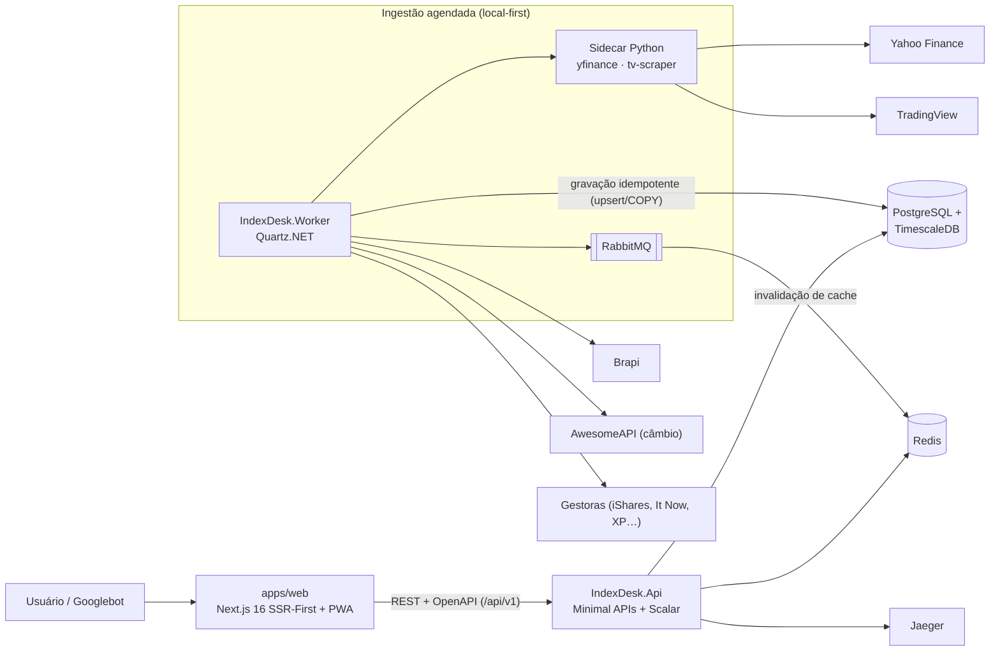

# IndexDesk — Inteligência, Backtest e Analytics de ETFs e BDRs da B3

O **IndexDesk** (nome de produto nos documentos: _ETFHub B3_) é uma plataforma web para investidores brasileiros que querem ir além da página da gestora: catálogo rico de **ETFs listados na B3 e BDRs de ETFs**, composição de carteiras (holdings) atualizada, painel fiscal completo (Come-Cotas, IR swing trade 15% / day trade 20%, regras de DARF), comparador multi-ativos, simulador de backtest de carteiras, calculadoras públicas e rankings de métricas. Todo o conteúdo pesado de dados é servido a partir de um banco local, com forte foco em SEO programático — cada ticker tem sua própria página indexável (`/etf/[ticker]`, `/bdr/[ticker]`). O público-alvo são investidores pessoa física de longo prazo, entusiastas de ETFs e criadores de conteúdo financeiro que precisam comparar e simular alocações com dados confiáveis e tributação correta para o mercado brasileiro.

## Mapa do monorepo

O [Turborepo](turbo.json) orquestra **todos** os workspaces via Bun — incluindo o backend .NET, cujas tarefas `build`/`test` cacheiam `bin/**` e `obj/**`.

| Caminho | Responsabilidade |
| :--- | :--- |
| [`apps/web`](apps/web) | Frontend **Next.js 16.3** (App Router, `src/`), SSR-First com React Query (`prefetchQuery` + dehydration), PWA com Serwist, Tailwind v4 + shadcn/Base UI, suite TanStack (Query/Table/Form/Virtual/Hotkeys), zustand + nuqs, Oxlint/Oxfmt, Vitest. Rotas públicas (`/etf/[ticker]`, `/comparador`, `/ferramentas`, `/rankings`) e backoffice `/admin`. |
| [`apps/backend`](apps/backend) | **Monólito modular .NET 9** (`IndexDesk.sln`, C# 13): `IndexDesk.Api` (Minimal APIs + OpenAPI via Scalar), `IndexDesk.Worker` (ingestão agendada com Quartz.NET), `Modules/` (Auth, MarketData, Analytics, Portfolio) e `BuildingBlocks/` (Persistence, Cache, Resilience, Messaging, Observability). CSharpier + `dotnet format`, xUnit + FluentAssertions. |
| [`tools/providers/sidecar`](tools/providers/sidecar) | Processo auxiliar **Python** (gerenciado com `uv`) chamado pelo Worker .NET para buscar cotações/proventos no Yahoo Finance (`yfinance`) e TradingView (`tv-scraper`), herando os mecanismos anti-bloqueio dessas libs. Contrato versionado: NDJSON no stdout. |
| [`tools/providers/recon`](tools/providers/recon/recon.md) | Especificação das fontes externas obtida por recon de requests (HARs versionados em `hars/`): endpoints reais, autenticação, WAF e classificação de replicabilidade. |
| [`plans`](plans) | Planos de iniciativa (ex.: [`plans/provider-sync-scrapers.md`](plans/provider-sync-scrapers.md)), com tracker de progresso e registro de decisões. |
| [`prototypes`](prototypes) | Protótipos de exploração (ex.: simulador de backtest). |
| `docker/` · [`docker-compose.yml`](docker-compose.yml) | Infra local: PostgreSQL + TimescaleDB, Redis, RabbitMQ e Jaeger (scripts de init em `docker/init-db`). |
| `.roadmap/` · [`ROADMAP.md`](ROADMAP.md) | Fonte única de progresso do projeto. `ROADMAP.md` é gerado — edite `.roadmap/**/*.json` e regenere com `bun run roadmap:check`. |

## Quickstart

**Pré-requisitos:** [Bun](https://bun.sh) 1.4+ (nunca npm/yarn/pnpm), [.NET SDK 9](https://dotnet.microsoft.com/download/dotnet/9.0) e Docker com Compose.

```bash
# 1. Dependências dos workspaces JS/TS
bun install

# 2. Variáveis de ambiente (chaves de provedores, strings de conexão)
cp .env.example .env   # ajuste conforme necessário; segredos nunca vão para commits

# 3. Infra local: TimescaleDB (:5432), Redis (:6379), RabbitMQ (:5672/:15672), Jaeger (:16686)
docker compose up -d

# 4. Web (Next.js em :3000) + Backend (.NET watch em :5000) juntos
bun run dev
```

Com o ambiente de pé: app em `http://localhost:3000`, API em `http://localhost:5000` (`/health` para status, Scalar UI em `/scalar/v1` apenas em Development).

### Comandos (da raiz, via Turborepo)

| Comando | O que faz |
| :--- | :--- |
| `bun run dev` | Dev servers de todos os workspaces (`next dev --turbopack` + `dotnet watch`). |
| `bun run build` | Build de produção (`next build` + `dotnet build -c Release`). |
| `bun run lint` | Oxlint (web) + analyzers `dotnet format` (backend). |
| `bun run typecheck` | `tsc --noEmit` (web) + build/analyzers .NET (backend). |
| `bun run test` | Vitest (web) + `dotnet test` (backend). |
| `bun run format` / `format:check` | Oxfmt (web) + CSharpier (backend); `format:check` é o gate de CI. |
| `bun run clean` | Limpa artefatos de todos os workspaces. |
| `bun run roadmap:validate` / `roadmap:generate` / `roadmap:check` | Validação e geração do `ROADMAP.md` a partir de `.roadmap/`. |

Para trabalhar em um único app, entre na pasta (`cd apps/web` ou `cd apps/backend`) e use os comandos locais documentados em `apps/*/CLAUDE.md`.

## Dados de mercado e provedores externos (local-first)

Nenhuma requisição de usuário chama uma API externa em tempo real: backtests, comparações e páginas de ativo leem apenas o Postgres/TimescaleDB e o Redis locais. Os provedores são consultados **somente** pelo `IndexDesk.Worker`, em jobs agendados com rate limit respeitado, gravando de forma idempotente (upsert/COPY) e publicando eventos no RabbitMQ para invalidação de cache no Redis.

Cadeia atual de fontes:

| Fonte | Papel | Acesso |
| :--- | :--- | :--- |
| **Brapi** | Primário B3: lote diário pós-fechamento + proventos (plano free apertado, ~10 req/min → chamadas batch e fila espaçada) | REST, chave(s) em `.env` |
| **Yahoo Finance** | Volume, histórico/backfill e benchmarks globais (`^BVSP`, `USDBRL=X`, `GC=F`) | Via **sidecar Python** (`yfinance`) |
| **TradingView** | Histórico OHLCV adicional para tickers não cobertos pelos demais | Via **sidecar Python** (`tv-scraper`) |
| **AwesomeAPI** | Câmbio (USD-BRL, EUR-BRL, BTC-BRL), secundária após Yahoo | REST gratuito, sem chave |
| **InfoMoney (XP)** | Cotações e proventos B3 alternativos (API Azure APIM atrás de WAF Akamai) | Via sidecar (`curl_cffi`) |
| **Feeds de gestoras** | Holdings/composição oficial (iShares BlackRock BR, It Now/Itaú Asset, XP Asset etc.) | HTTP/CSV/XLSX, com transporte sidecar quando há WAF |

O contrato entre o Worker .NET e o sidecar é NDJSON versionado no stdout (erros como envelope no stderr), com modo fixture para testes sem rede. Detalhes completos:

- Regras de provedores, rate limits e TTLs de cache: [`PROVIDERS.md`](PROVIDERS.md)
- Filosofia de ingestão/sync local-first: [`PROVIDERS_SYNC.md`](PROVIDERS_SYNC.md)
- Sidecar (contrato NDJSON, comandos, fixtures): [`tools/providers/sidecar/README.md`](tools/providers/sidecar/README.md)
- Recon das fontes e HARs capturados: [`tools/providers/recon/recon.md`](tools/providers/recon/recon.md)
- Plano e histórico da iniciativa de provider sync: [`plans/provider-sync-scrapers.md`](plans/provider-sync-scrapers.md)

## Documentação canônica

| Documento | Conteúdo |
| :--- | :--- |
| [`PRODUCT.md`](PRODUCT.md) | Visão do produto, módulos e estratégia de crescimento. |
| [`STACK_SETUP.md`](STACK_SETUP.md) | Arquitetura técnica completa, topologia do monólito modular e toolchain. |
| [`MODELS.md`](MODELS.md) | Schema do banco (PostgreSQL + TimescaleDB), hypertables e DDL. |
| [`PROVIDERS.md`](PROVIDERS.md) | Provedores externos, rate limits e regras de cache. |
| [`PROVIDERS_SYNC.md`](PROVIDERS_SYNC.md) | Princípio local-first e pipeline de ingestão. |
| [`SEO_TOOLS.md`](SEO_TOOLS.md) | Calculadoras/ferramentas públicas e SEO programático. |
| [`ROADMAP.md`](ROADMAP.md) | Progresso por fase (gerado a partir de `.roadmap/`). |
| [`plans/`](plans) | Planos detalhados por iniciativa. |
| [`CLAUDE.md`](CLAUDE.md) / [`AGENTS.md`](AGENTS.md) | Instruções para agentes de código; convenções por workspace em `apps/*/CLAUDE.md`. |
| [`.agents/skills/indexdesk/`](.agents/skills/indexdesk) | Skill interna com conhecimento do projeto (regras de mercado B3, imposto, fórmulas financeiras). |

## Topologia



Fluxo essencial: o usuário só fala com o Next.js, que só fala com a API .NET — que responde do banco e cache locais. Provedores externos entram apenas pela ingestão agendada do Worker (diretamente ou via sidecar Python), mantendo toda leitura de usuário dentro da infraestrutura própria.
