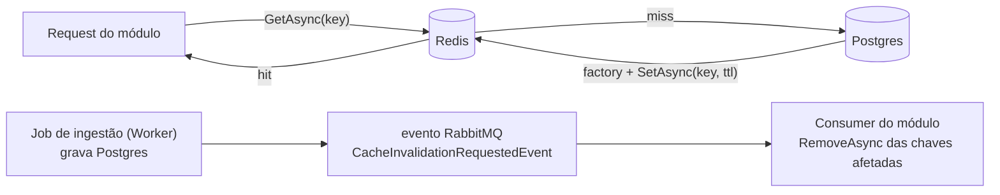

# BuildingBlocks.Cache — ICacheService (Redis + fallback) (scoped)

> Companion to [`../../CLAUDE.md`](../../CLAUDE.md). Abstração única de cache da solução: `ICacheService`
> sobre StackExchange.Redis. **Não conhece chaves de negócio nem TTLs específicos** — quem define
> chave/TTL é o módulo consumidor (canônico:
> [`../../Modules/IndexDesk.Modules.MarketData/CLAUDE.md`](../../Modules/IndexDesk.Modules.MarketData/CLAUDE.md)).
> **Do not modify code** when only instruction updates are requested.

## Mapa de arquivos

| Arquivo | Conteúdo |
| :--- | :--- |
| `ICacheService.cs` | Interface (`GetAsync<T>`, `SetAsync<T>`, `RemoveAsync`, `GetOrCreateAsync<T>`) + `RedisCacheService`: `IConnectionMultiplexer` injetado, JSON via System.Text.Json (`PropertyNameCaseInsensitive`). |

Dependências: StackExchange.Redis 2.8.24 · Caching.Abstractions/Logging.Abstractions 9.0.2 ·
referência apenas para `BuildingBlocks.Common`.

## Semântica à prova de falha (contrato intencional)

- **Nenhuma operação lança.** Redis fora do ar = LogWarning + `default` no get / write ignorado no set —
  cache é otimização, nunca fonte de verdade (Postgres é). Não "conserte" com throw: derrubaria endpoints
  que funcionam só com DB.
- `GetOrCreateAsync` só cachêia resultado **não nulo** do factory; `null` volta sem cachear.
- Serialização JSON case-insensitive — chaves de DTO em qualquer casing desserializam.

## Wiring nos hosts (fallback mora LÁ, não aqui)

Ambos os hosts fazem `ConnectionMultiplexer.Connect` dentro de try/catch na inicialização:

- Conectou → singleton `RedisCacheService`.
- Falhou (dev sem docker) → classe fallback local do host: `InMemoryCacheFallback`
  ([`IndexDesk.Api/Program.cs`](../../IndexDesk.Api/Program.cs)) e `WorkerInMemoryCacheFallback`
  ([`IndexDesk.Worker/Program.cs`](../../IndexDesk.Worker/Program.cs)), sobre `Dictionary` em processo.

**Preserve esse fallback** (exigido por [`../../CLAUDE.md`](../../CLAUDE.md) §Building Blocks): dev local
precisa subir sem Redis. Se um dia o fallback virar código compartilhado, deve migrar PARA este bloco —
uma única implementação, não duas.

## TTLs por classe de dado (política de [`PROVIDERS_SYNC.md`](../../../../../PROVIDERS_SYNC.md))

| Dado | TTL |
| :--- | :--- |
| Cotação histórica fechada | 30 dias / infinita (passado não muda) |
| Pregão do dia vigente | 15 minutos |
| Indicadores macro (CDI/Selic/IPCA), feriados | 24 horas |
| Holdings / CDA / feeds de gestora | 7 dias |

Em código hoje (`AssetQueryService`): 10–15 min p/ catálogo/dia corrente, 30 min, 24 h p/ séries fechadas.
TTL é argumento de `SetAsync` — não existe TTL default escondido aqui.

## Read/write & invalidação

Invalidação é orientada a evento (só as chaves afetadas) — ver
[`../BuildingBlocks.Messaging/CLAUDE.md`](../BuildingBlocks.Messaging/CLAUDE.md). Política formal pendente
em DEC-002.

## Regras fixas

- Chave de cache e TTL são definidos pelo módulo; convenção real (`AssetQueryService`): prefixo por
  domínio + versão — `marketdata:quotesbatch:{tickers}:{windowDays}`, `marketdata:dividends:{ticker}:v1`.
- Nada de acesso direto a `IConnectionMultiplexer` fora deste bloco; consumidores recebem `ICacheService`.
- Nunca cachear dados de usuário autenticado sob chave compartilhada; segredos/tokens jamais viram valor.
- Cache frio é estado válido: sempre haver caminho Postgres atrás do miss (<10ms alvo Local-First).
