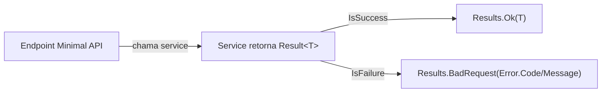

# BuildingBlocks.Common — Result, Pagination, Time (scoped)

> Companion to [`../../CLAUDE.md`](../../CLAUDE.md). Camada-base da solução: tipos utilitários cross-cutting
> **sem referenciar nenhum outro projeto** — todos os outros blocos e módulos dependem deste, nunca o
> contrário. **Do not modify code** when only instruction updates are requested.

## Mapa de arquivos

| Arquivo | Conteúdo |
| :--- | :--- |
| `Results/Result.cs` | `Error` (record com fábricas `NotFound`/`Validation`/`Unauthorized`/`Conflict`/`Failure`) + `Result` / `Result<TValue>` com guardas: sucesso nunca carrega error; falha sempre carrega; `Value` de falha lança `InvalidOperationException`. Implicit operator `TValue → Result<TValue>`. |
| `Pagination/PagedResult.cs` | `PagedResult<T>` record: `Items`, `Page`, `PageSize`, `TotalCount` (long) + calculados `TotalPages`, `HasNextPage`, `HasPreviousPage`. |
| `Time/IClock.cs` | `IClock` (`UtcNow`, `Today`) + `SystemClock`. Injete `IClock` em vez de chamar `DateTime.UtcNow` direto — testes congelam tempo sem sleep. |

Pacotes no csproj: FluentValidation 11.11.0 · MediatR 12.4.1 · Logging.Abstractions 9.0.2 (reservados p/
validação/pipeline; ainda sem uso nos arquivos atuais). Zero `ProjectReference` — folha do grafo.

## Por que records imutáveis (e não classes mutáveis)

São `sealed record` — igualdade **por valor**, imutáveis, thread-safe por construção. Comportamento de
value type sem custo/limitação de `struct` (cópias, boxing em generics). Regra: novos tipos aqui seguem
o mesmo padrão; nada de setters públicos.

## Regras de uso pelos módulos

- **Erros como código, não exceção:** handlers de endpoint retornam `Result`/`Result<TValue>`;
  códigos de erro seguem `Dominio.Situacao` (ex.: `Brapi.HttpError`, `Provider.CircuitOpen`,
  criados via `Error.Failure(code, msg)`). Exceções ficam para bugs e para a ponte
  [`BuildingBlocks.Resilience`](../BuildingBlocks.Resilience/CLAUDE.md) (`ProviderCallException`),
  que traduz falha de `Result` em exceção Polly e volta.
- **Não invente segundo mecanismo de retorno** (tuple `(ok, err)`, exceptions de negócio): tudo passa
  por `Result`. Adicione fábrica nova em `Error` apenas se o código for reusado por 2+ módulos.
- **Paginação:** endpoints de lista retornam `PagedResult<T>`; `TotalCount` é long porque séries CVM/
  holdings passam de int. Não replique campos de paginação em DTO próprio.
- **Tempo:** sempre UTC (`UtcNow`); `Today` = `DateOnly` UTC para datas de pregão. Jobs de ingestão e
  cálculos financeiros recebem `IClock` injetado.

## Fluxo típico

## Regras fixas

- Este bloco **nunca** referencia `Modules/*`, hosts ou outros building blocks (é a base).
- Tipos novos aqui precisam ser genéricos/cross-cutting (úteis para 2+ módulos); lógica de domínio
  vai para o módulo, não pra cá.
- Mensagens de `Error` são técnicas (log/UI dev); copy de usuário final fica no frontend.
- Mudança de assinatura em `Result`/`Error` quebra toda a solução — trate como API pública interna.
