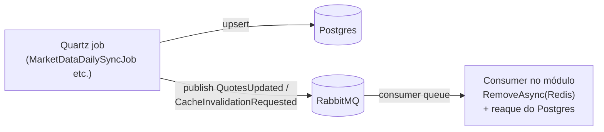

# BuildingBlocks.Messaging — MassTransit + RabbitMQ (scoped)

> Companion to [`../../CLAUDE.md`](../../CLAUDE.md). Contratos de eventos de integração da solução. **Não
> conhece jobs, módulos nem chaves de cache concretas** — publica/consome quem tem o contexto.
> **Do not modify code** when only instruction updates are requested.

## Mapa de arquivos

| Arquivo | Conteúdo |
| :--- | :--- |
| `Events/IntegrationEvent.cs` | `IIntegrationEvent` (`Id`, `OccurredOnUtc`) + base abstrata `IntegrationEvent` (record, `Guid.NewGuid()`/`DateTime.UtcNow` no init) + os dois eventos atuais: `QuotesUpdatedIntegrationEvent(Ticker, ReferenceDate, ClosePrice)` e `CacheInvalidationRequestedEvent(CacheKeyPattern, Reason)`. |

Dependências: MassTransit 8.3.6 + MassTransit.RabbitMQ 8.3.6 · referência apenas para
`BuildingBlocks.Common`.

## Estado atual (honesto): contratos definidos, bus ainda não wired

- Nenhum host chama `AddMassTransit` ainda (`IndexDesk.Api` / `IndexDesk.Worker` não referenciam este
  projeto; hoje só `Modules.MarketData` referencia). RabbitMQ roda no docker-compose
  (`indexdesk-rabbitmq`, imagem `rabbitmq:3-management-alpine`) mas não há publisher/consumer em execução.
- Ao wirear: `AddMassTransit(x => x.UsingRabbitMq(...))` com `ConnectionStrings:RabbitMQ` do `.env`,
  chamada **após** Observability/Persistence/Cache nos `Program.cs`, seguindo
  [`../../CLAUDE.md`](../../CLAUDE.md) §Adding a Building Block.

## Para que existem (fluxo Local-First planejado)

Jobs do Worker gravam Postgres e publicam evento; consumidores invalidam só as chaves Redis afetadas e
reaquentam do banco ([`PROVIDERS_SYNC.md`](../../../../../PROVIDERS_SYNC.md)):

- `QuotesUpdatedIntegrationEvent`: cotação nova/ajustada pós-ingestão — consumidor decide o que reaquecer.
- `CacheInvalidationRequestedEvent`: pedido explícito por padrão de chave (`CacheKeyPattern`) + `Reason`
  auditável; complementa o TTL (ver [`../BuildingBlocks.Cache/CLAUDE.md`](../BuildingBlocks.Cache/CLAUDE.md)).

## Regras fixas

- Evento novo = record selado herdando `IntegrationEvent` neste projeto, imutável, só dados primitivos —
  consumidores de OUTRO processo podem desserializar; sem lógica, sem entidade EF dentro.
- Nome no passado/fato ocorrido (`XxxUpdated`, `YyySynced`); payload suficiente para o consumidor agir
  sem voltar ao produtor.
- Publicação acontece após commit no Postgres (nunca antes — evita evento de dado que não existe).
- Falha de broker nunca derruba o job de ingestão: Postgres é fonte de verdade; evento é best-effort com
  retry do transport.
- Sem domínio aqui: códigos de erro, tickers fixos, TTLs e nomes de chave pertencem aos módulos.
