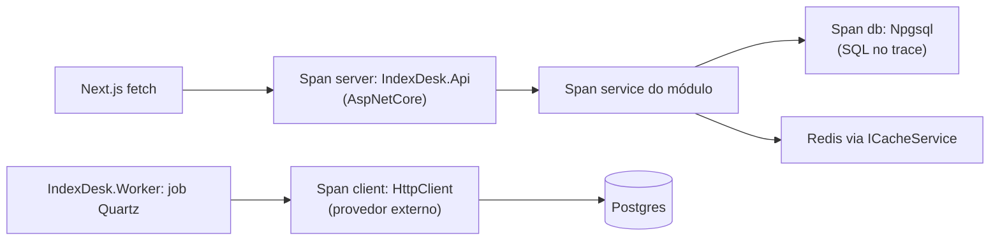

# BuildingBlocks.Observability — OpenTelemetry → Jaeger (scoped)

> Companion to [`../../CLAUDE.md`](../../CLAUDE.md). Único ponto de instrumentação OTel da solução. **Não
> conhece endpoints, jobs nem domínio** — só registra resource, sources e exporters.
> **Do not modify code** when only instruction updates are requested.

## Mapa de arquivos

| Arquivo | Conteúdo |
| :--- | :--- |
| `ObservabilityExtensions.cs` | `AddIndexDeskObservability(services, configuration, serviceName)` — resource (service name + version "1.0.0"), tracing e metrics com exporter OTLP. |

Dependências: OpenTelemetry 1.11.1 (+ Hosting, OTLP Exporter) · Instrumentation.AspNetCore/Http 1.11.0 ·
Npgsql.OpenTelemetry 9.0.2 · referência apenas para `BuildingBlocks.Common`.

## Contrato de chamada

```csharp
builder.Services.AddIndexDeskObservability(builder.Configuration, "IndexDesk.Api");
```

- **Sempre a primeira linha útil** do `Program.cs` — tanto em
  [`IndexDesk.Api`](../../IndexDesk.Api/Program.cs) quanto em [`IndexDesk.Worker`](../../IndexDesk.Worker/Program.cs)
  ("1. Observability" antes de Persistence/Cache/Quartz). Service name distingue os hosts no trace.
- Endpoint OTLP resolvido nesta ordem: config `OpenTelemetry:OtlpEndpoint` → env
  `OTEL_EXPORTER_OTLP_ENDPOINT` → default `http://localhost:4317`. Coletor = container
  `indexdesk-jaeger` (`jaegertracing/all-in-one`, `COLLECTOR_OTLP_ENABLED=true`); UI web na porta exposta
  pelo compose.

## O que está instrumentado

- **Traces:** source própria (`serviceName`) + `"Npgsql"`; instrumentação AspNetCore (requests HTTP,
  `RecordException = true`) e HttpClient (chamadas outbound, `RecordException = true`); export OTLP.
- **Metrics:** meter própria (`serviceName`) + AspNetCore + HttpClient; mesmo exporter OTLP.
- Spans Npgsql dão as queries SQL dentro do trace; spans HttpClient cobrem chamadas a provedores/sidecar
  nos jobs do Worker.

## Correlação ponta a ponta



Trace id conecta request → módulo → db/cache no Api e job → provedor → Postgres no Worker. Para ligar os
dois lados (job que causou invalidação consumida pelo Api), propague o correlation id do job — hoje cada
host gera trace próprio.

## Regras fixas

- Nada de dados sensíveis em spans: tokens JWT, chaves de provider, CNPJ de cotista ou valores
  financeiros não entram como tag/log (`PROVIDERS_SYNC.md` §Segredos). `RecordException` já basta p/
  diagnóstico; redija exceção se ela carregar payload.
- Instrumentação nova (Redis, MassTransit/RabbitMQ) entra **aqui**, num único lugar, nunca espalhada
  pelos hosts/módulos. StackExchange.Redis e MassTransit ainda sem instrumentation package adicionada —
  avaliar `OpenTelemetry.Instrumentation.StackExchangeRedis` quando cache virar hot path rastreado.
- Version do resource é constante "1.0.0"; mudar só com decisão de versionamento de serviço.
- Hosts não criam `ActivitySource` próprio fora do nome registrado aqui.
