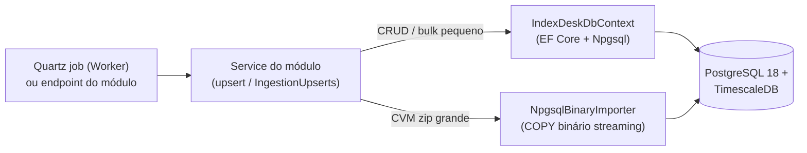

# BuildingBlocks.Persistence — EF Core + Npgsql (scoped)

> Companion to [`../../CLAUDE.md`](../../CLAUDE.md). Infra única de acesso a dados da solução: um
> `DbContext`, entidades POCO e mapeamento. **Não conhece provedores, jobs nem regras de negócio** —
> quem escreve são os módulos (consumidor canônico:
> [`../../Modules/IndexDesk.Modules.MarketData/CLAUDE.md`](../../Modules/IndexDesk.Modules.MarketData/CLAUDE.md),
> seção de escritas idempotentes). DDL canônica completa: [`../../../../../MODELS.md`](../../../../../MODELS.md).
> **Do not modify code** when only instruction updates are requested.

## Mapa de arquivos

| Arquivo | Conteúdo |
| :--- | :--- |
| `IndexDeskDbContext.cs` | Único `DbContext` (13 `DbSet`s: market data + auth/RBAC). Todo mapeamento vive em `OnModelCreating`: tabelas snake_case, PKs compostas, precisões, índices únicos e `SeedRbac`. |
| `Entities/*.cs` | 13 POCOs com GUID gerado no construtor e `CreatedAt` em UTC. Docs XML citam a seção de `MODELS.md` (ex.: `EtfHoldingEntity` = §etf_holdings, dedupe `(EtfAssetId, AsOfDate, HoldingTicker)`). |

Dependências: EF Core 9.0.2 · Npgsql.EntityFrameworkCore.PostgreSQL 9.0.3 · Npgsql 9.0.2 ·
referência apenas para `BuildingBlocks.Common`.

## Convenções do modelo (manter em qualquer entidade nova)

- Tabelas em snake_case (`assets`, `etf_holdings`, `fx_rates`); colunas de data **sempre** na PK composta
  das séries: `asset_quotes (AssetId, Date)`, `fx_rates (Pair, Date)`, `macro_economic_series (SeriesCode, Date)`.
- `decimal` com precisão explícita: cotações `(14,4)`, volume `(18,2)`, FX bid/ask `(18,8)`,
  `weight_percentage (6,4)` — armazenado como fração (`0.0850` = 8.50%).
- Índice único é a **chave de idempotência** da ingestão: `etf_holdings (EtfAssetId, AsOfDate, HoldingTicker)`,
  `asset_dividends (AssetId, ComDate, Rate)` — upserts re-executáveis nunca duplicam linha.
- Extensões Postgres: `uuid-ossp` + `pgcrypto`. `SeedRbac` (roles Admin/Pro/User + 9 permissões) é dado
  estático de aplicação — mercado só entra via ingestão, nunca via seed.
- Códigos SGS em `MacroEconomicSeriesEntity`: 12 CDI · 11 Selic · 433 IPCA · 189 IGP-M.
- FX não tem OHLCV: `Bid` faz papel de close, `Ask` completa o spread (`FxRatesDailySyncJob`, AwesomeApi).

## Hypertables & migrations (estado real)

- Hypertables TimescaleDB (`asset_quotes` e `fund_daily_reports` chunk 1 ano, `macro_economic_series`
  chunk 5 anos) nascem do DDL de `MODELS.md` (`create_hypertable(...)`), **fora** do EF. `fx_rates` e
  `etf_holdings` são tabelas comuns. Em backtest use sempre `adj_close`.
- **Não há pasta `Migrations/` ainda.** Em Development o Api roda `EnsureCreatedAsync()` antes do primeiro
  request (`IndexDesk.Api/Program.cs`). Qualquer alteração de schema deve espelhar `MODELS.md`; migrations
  EF ficam para quando o projeto adotá-las — não invente snapshot parcial.

## Fluxo de escrita (quem chama o quê)

COPY streaming mora no consumidor (`Modules.MarketData.Ingestion`), não aqui — este bloco fornece o
driver Npgsql e o contexto. Arquivo grande jamais é carregado inteiro em RAM: CsvHelper em stream +
filtro de CNPJ **antes** do COPY (50k+ linhas/s, reexecução segura).

## Regras fixas

- Entidade nova = arquivo em `Entities/` + `DbSet` + mapeamento completo em `OnModelCreating`
  (tabela, PK, precisão, índices de idempotência). Nada de mapeamento por atributo solto.
- Leitura analítica pesada (backtest/comparador) pertence ao módulo Analytics (queries projetadas);
   este bloco não ganha repositórios genéricos nem helpers de query.
- Sempre UTC (`DateTimeOffset`, `DateOnly` para datas de pregão). Nunca confie em fuso local.
- Escrita idempotente é contrato do Local-First: re-run do job atualiza, nunca duplica.
