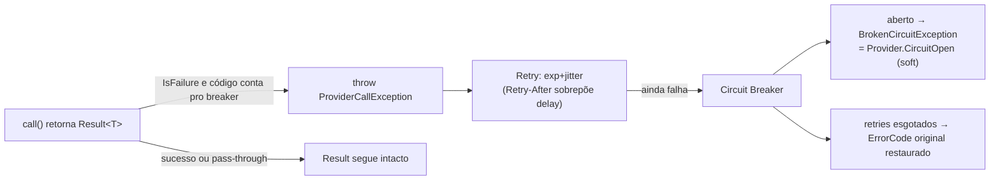

# BuildingBlocks.Resilience — Pipelines Polly & Ponte Result⇄Exceção (scoped)

> Companion to [`../../CLAUDE.md`](../../CLAUDE.md) (convenções de `src/`) e ao índice da coleção
> [`../CLAUDE.md`](../CLAUDE.md). Infra pura de resiliência: **não conhece provedores,
> módulos nem domínio** — só pipelines Polly e o tipo de exceção que traduz falhas de `Result<T>`
> para as estratégias. Consumidor canônico: [`../../Modules/IndexDesk.Modules.MarketData/CLAUDE.md`](../../Modules/IndexDesk.Modules.MarketData/CLAUDE.md)
> (seção "Breaker por provider"). **Do not modify code** when only instruction updates are requested.

## Mapa de arquivos

| Arquivo | Conteúdo |
| :--- | :--- |
| `ResiliencePipelines.cs` | Fábricas estáticas de `ResiliencePipeline`. `CreateDefaultHttpPipeline(maxRetries = 3)` = retry exponencial+jitter (base 500 ms) + timeout 10 s, genérico. `CreateProviderCallPipeline<T>(...)` = pipeline oficial de chamadas a provedor. |
| `ProviderCallException.cs` | Exceção-ponte: carrega um `Error` (`ErrorCode`, ex. `Brapi.HttpError`) + hint opcional `RetryAfter` (`TimeSpan?`). Polly só reage a este tipo. |

Dependências: Polly 8.5.2 (+ Polly.Core) · Microsoft.Extensions.Http.Resilience 9.2.0 ·
referência apenas para `BuildingBlocks.Common` (`Result<T>`/`Error`).

## `CreateProviderCallPipeline<T>` — contrato

```csharp
ResiliencePipeline<Result<T>> CreateProviderCallPipeline<T>(
    int maxRetries,                                  // 0 pula o estágio de retry
    TimeSpan retryBaseDelay,                         // base do backoff exponencial
    Func<ProviderCallException, bool> retryPredicate,   // quais códigos sofrem retry
    Func<ProviderCallException, bool> breakerPredicate, // quais códigos contam pro breaker
    int breakerMinimumThroughput,                    // mín. chamadas na janela p/ abrir
    double breakerFailureRatio,                      // 1.0 = 100% das chamadas da janela
    TimeSpan breakerSamplingDuration,                // janela de amostragem (ex. 60 s)
    TimeSpan breakerBreakDuration,                   // tempo aberto antes do half-open
    TimeProvider? timeProvider = null)               // seam p/ relógio fake em testes
```

- **Retry:** exponencial + jitter; quando o `ProviderCallException` traz `RetryAfter`, o
  `DelayGenerator` usa esse valor **no lugar** do backoff calculado (hint do servidor vence).
- **Breaker:** predicados **independentes** — uma falha pode contar pro breaker sem merecer retry
  imediato (ex.: `Scrape.WafBlocked`, `*.AuthFailed`: parede não sai a tiros, mas precisa abrir).
  "5 falhas / 60 s" = `MinimumThroughput 5` + `FailureRatio 1.0` + janela 60 s; depois de
  `breakerBreakDuration` Polly admite chamadas half-open e fecha no sucesso.
- **Estado do breaker vive na instância retornada** — quem chama deve cachear o pipeline por
  provider (o consumidor cacheia por `(provider, typeof(T), modo)` num singleton).
- **TimeProvider:** quando informado, vira `builder.TimeProvider` — testes avançam o relógio sem
  sleep (`tests/IndexDesk.UnitTests/Helpers/ResilienceTestKit.cs`). Produção passa `null`.
- Ambos os estágios tratam **apenas** `ProviderCallException`; qualquer outra exceção atravessa.

## Fluxo do pipeline



## Onde mora cada responsabilidade (NÃO duplicar aqui)

- **Taxonomia de erros provider.\*** (sufixos `.HttpError`, `.RateLimit`, `.AuthFailed`,
  `Scrape.WafBlocked`, `Sidecar.*`…): definida pelo consumidor
  `Modules.MarketData.Resilience.ProviderResilience` via `retryPredicate`/`breakerPredicate`.
  Este bloco não sabe o que os códigos significam.
- **Reporte de saúde:** pool de chaves reporta cooldown próprio (dono do modo `.RateLimit`);
  circuito aberto vira resultado soft `Provider.CircuitOpen`; ambos descem como linhas em
  `sync_job_logs`, agregadas por `Modules.MarketData.Health.ProviderHealthAggregator`.

## Regras fixas

- Building block = infra only: sem tipos de domínio, sem referência a `Modules/*`.
- Adicione novas fábricas de pipeline AQUI (estáticas), nunca dentro de módulos; knobs/tuning por
  provider ficam no consumidor (config `Providers:Resilience:*`).
- Não troque Polly por Middleware/try-catch manual: retry com backoff, breaker com estado e
  injeção de relógio são exatamente o que este bloco encapsula.
