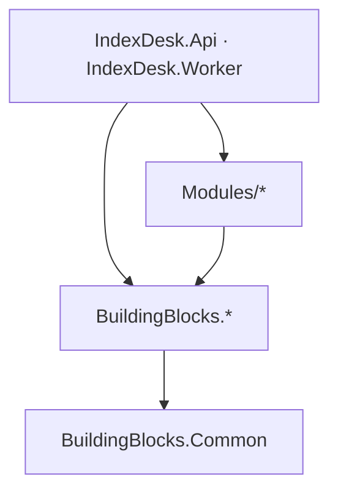

# BuildingBlocks — Infra compartilhada (coleção de projetos)

> Companion to [`../CLAUDE.md`](../CLAUDE.md) (convenções de `src/`) e [`../../CLAUDE.md`](../../CLAUDE.md).
> Esta pasta **não é um projeto**: é uma coleção. Cada subpasta é um projeto independente com doc
> própria linkada abaixo. Zero conhecimento de domínio — quem conhece ETF/taxa/backtest é `Modules/*`.
> **Do not modify code** when only instruction updates are requested.

## Índice dos 6 blocos

| Bloco | Escopo | Doc dedicada |
| :--- | :--- | :--- |
| `BuildingBlocks.Common` | `Result<T>`/`Error`, Pagination, Time — tipos de valor cross-cutting; único bloco sem deps | [`BuildingBlocks.Common/CLAUDE.md`](./BuildingBlocks.Common/CLAUDE.md) |
| `BuildingBlocks.Persistence` | EF Core + Npgsql, entidades, COPY em lote via `NpgsqlBinaryImporter` | [`BuildingBlocks.Persistence/CLAUDE.md`](./BuildingBlocks.Persistence/CLAUDE.md) |
| `BuildingBlocks.Cache` | `ICacheService` sobre StackExchange.Redis; falha-mole (nunca lança) | [`BuildingBlocks.Cache/CLAUDE.md`](./BuildingBlocks.Cache/CLAUDE.md) |
| `BuildingBlocks.Resilience` | Pipelines Polly (retry/breaker) + `ProviderCallException` (ponte Result⇄Exceção) | [`BuildingBlocks.Resilience/CLAUDE.md`](./BuildingBlocks.Resilience/CLAUDE.md) |
| `BuildingBlocks.Messaging` | Contratos `IntegrationEvent` para MassTransit/RabbitMQ (ingestão → invalidação de cache) | [`BuildingBlocks.Messaging/CLAUDE.md`](./BuildingBlocks.Messaging/CLAUDE.md) |
| `BuildingBlocks.Observability` | `AddIndexDeskObservability(...)` OpenTelemetry → Jaeger | [`BuildingBlocks.Observability/CLAUDE.md`](./BuildingBlocks.Observability/CLAUDE.md) |

## Onde mora cada responsabilidade

- **Chave de cache/TTL específico** → módulo consumidor (não no bloco Cache).
- **Knobs de retry/breaker por provider** (`Providers:Resilience:*`) → consumidor; fábricas de
  pipeline genéricas → Resilience.
- **Entidades e mapeamentos** → Persistence/Entities; regra de negócio sobre elas → módulos.
- **Eventos de integração (contrato)** → Messaging/Events; publicação/consumo → hosts/módulos.
- **Traces/logs correlacionados** → Observability (hosts chamam primeiro no Program.cs).

## Direção de dependência

Todo bloco referencia apenas `Common` (confirmar nos `.csproj` antes de adicionar qualquer aresta nova).

## Quando criar um building block novo

Crie `BuildingBlocks.<Nome>/` somente quando **todas** as condições valerem:

1. ≥2 módulos precisam da mesma capacidade (reuso real, não especulativo).
2. Capacidade é infra genérica, sem vocabulário de domínio (nada de ticker/carteira/imposto).
3. Expõe `Add<Nome>(this IServiceCollection, IConfiguration)` + interfaces próprias.
4. Entra como ProjectReference nos hosts que a usam.

Caso contrário: helper privado dentro do módulo, ou tipo de valor em `Common`. Passo a passo:
[`../CLAUDE.md`](../CLAUDE.md), seção "Adding a Building Block".

## Regras fixas

- Blocos **nunca** referenciam `Modules/*` nem outros blocos além de `Common`.
- Hosts/consumidores dependem das **interfaces**; Redis/EF/MassTransit nunca são `new` inline.
- `AddIndexDeskObservability` é sempre o **1º** registro no Program.cs de ambos os hosts.
- Segredos ficam em `.env`/env vars (`ConnectionStrings__*`, `Providers__*`);
  `appsettings.json` carrega só defaults de dev.
