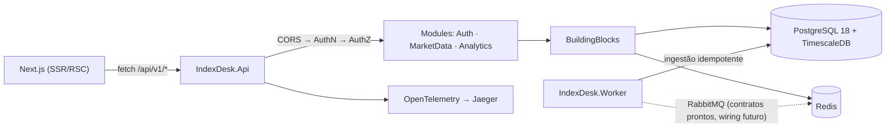

# IndexDesk.Api — Host HTTP & Minimal APIs (scoped)

> Companion to [`../CLAUDE.md`](../CLAUDE.md) e [`../../CLAUDE.md`](../../CLAUDE.md).
> Este host **nunca** chama provedor externo: toda leitura vem do Postgres/Redis que o
> [`IndexDesk.Worker`](../IndexDesk.Worker/CLAUDE.md) alimenta (local-first, NON-NEGOTIABLE).
> **Do not modify code** when only instruction updates are requested.

## Composição do `Program.cs` (ordem importa)

Registro de serviços:

1. `AddIndexDeskObservability(configuration, "IndexDesk.Api")` — sempre primeiro (OTel → Jaeger).
2. DbContext Npgsql (`DefaultConnection` → fallback `Postgres` → default dev local).
3. Redis em try/catch **na inicialização**: conectou → singleton `IConnectionMultiplexer` +
   `RedisCacheService`; senão → `AddDistributedMemoryCache()` + `InMemoryCacheFallback`
   (classe definida no fim do próprio Program.cs — preservar o fallback, nunca derrubar o host).
4. Módulos: `AddAuthModule(configuration)` · `AddMarketDataModule(configuration)` ·
   `AddAnalyticsModule()`.
5. `AddHealthChecks()` · CORS `"AllowWeb"` · `AddOpenApi(...)` com document transformer
   (título/descrição + security scheme HTTP Bearer JWT aplicado globalmente — equivalente a
   SwaggerDoc + AddSecurityDefinition do Swashbuckle).

Depois do `Build()`:

1. Em Development: `EnsureCreatedAsync()` cria o schema local antes do 1º request (ainda não há
   migrations; dados de mercado chegam só por ingestão do Worker).
2. `MapOpenApi()` → documento OpenAPI (`Microsoft.AspNetCore.OpenApi`).
3. `MapScalarApiReference(...)` → UI Scalar em `/scalar/v1`.
4. Pipeline: `UseCors("AllowWeb")` → `UseAuthentication()` → `UseAuthorization()`.
5. Rotas fixas: `MapHealthChecks("/health")` e `GET /` (status JSON com link `/scalar/v1`).
6. Módulos: `MapAuthEndpoints()` → `MapMarketDataEndpoints()` → `MapAnalyticsEndpoints()`.

## Rotas registradas (resumo — contratos completos nos docs dos módulos)

| Grupo | Rotas | Doc |
| :--- | :--- | :--- |
| `/api/v1/auth` | POST `signup` `signin` `refresh` `signout` · GET `me` (autorizado) | [`Modules Auth`](../Modules/IndexDesk.Modules.Auth/CLAUDE.md) |
| `/api/v1/assets` | POST `sync/daily` `sync/backfill` `sync/macro` · GET `` / `` `rankings` `{ticker}` `{ticker}/quotes` `{ticker}/dividends` `{ticker}/performance` `quotes/batch` `macro-series` `market-indicators` | [`Modules MarketData`](../Modules/IndexDesk.Modules.MarketData/CLAUDE.md) |
| `/api/v1/providers` | GET `health` (saúde dos providers via agregação de `sync_job_logs`) | idem acima |
| `/api/v1/analytics` | POST `backtest` · GET `real-yield` | fonte: `AnalyticsModuleExtensions.cs` |

Módulo novo = criar `Add<Name>Module`/`Map<Name>Endpoints` e registrar AQUI nas duas seções
(veja [`../CLAUDE.md`](../CLAUDE.md), "Adding a domain module"). Nada de regra de negócio no
Program.cs — o host é casca fina.

## OpenAPI + Scalar (sem Swashbuckle)

- Documento gerado por **Microsoft.AspNetCore.OpenApi** (`MapOpenApi()`); UI por
  **Scalar.AspNetCore** em `/scalar/v1`. **Nunca** adicionar Swashbuckle/Swagger.
- O transformer dentro de `AddOpenApi` injeta `Info` (título/versão/descrição) e o esquema
  Bearer JWT global — manter centralizado lá, não repetir por endpoint.

## Autenticação (módulo Auth)

- JWT Bearer HS256 (`Jwt:*`; access ~15 min). Refresh token vive **só** em cookie HttpOnly
  (`refreshToken`, Path=`/api/v1/auth`, SameSite=Lax), rotacionado a cada `/refresh`.
- Regras de rotação/reuso/hash: ver doc do módulo Auth — não redefinir aqui.

## CORS `"AllowWeb"`

Hoje: `SetIsOriginAllowed(_ => true)` + AllowAnyHeader/Method + **AllowCredentials** — qualquer
origem com cookies, aceitável apenas no dev local. Antes de produção, trocar por allowlist
explícita (`Web:AppUrl`, default `http://localhost:3000`). Não remover `AllowCredentials`: o
cookie de refresh exige.

## Pendências conhecidas (não "corrigir" silenciosamente)

- `MapOpenApi()`/`MapScalarApiReference()` rodam em **qualquer ambiente**; a convenção documentada é
  dev-only. Gatear com `app.Environment.IsDevelopment()` é mudança de comportamento — exige decisão.
- RabbitMQ/MassTransit ainda não está wired neste host: os contratos existem no bloco Messaging
  (`QuotesUpdatedIntegrationEvent`, `CacheInvalidationRequestedEvent`); consumo/invalidação de cache
  via eventos é fase futura.

## `public partial class Program { }`

Obrigatório para `WebApplicationFactory<Program>` nos IntegrationTests — não remover nem tornar
internal. A classe `InMemoryCacheFallback` mora no fim deste arquivo; movê-la só junto com o
fallback equivalente do Worker (mesmo contrato `ICacheService`).

## Fluxo de um request

Regra fixa: request path lê **somente** Postgres/Redis locais (<~10ms alvo) — nunca provider externo.
