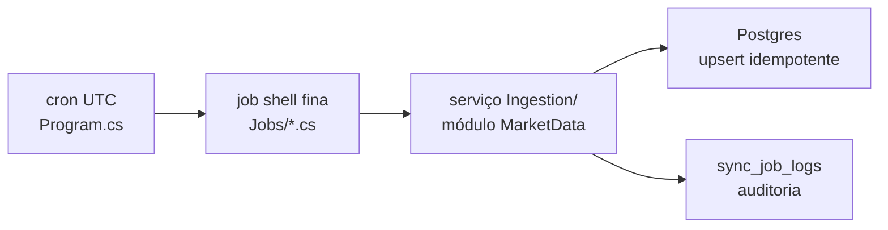

# IndexDesk.Worker/Jobs — Jobs Quartz (scoped)

> Companion to [`../CLAUDE.md`](../CLAUDE.md) e [`../../CLAUDE.md`](../../CLAUDE.md).
> Pasta de **casca fina**: cada job é um shell que dispara um serviço do módulo MarketData.
> Toda regra de negócio, acesso a provider e upsert moram em
> [`../../Modules/IndexDesk.Modules.MarketData/Ingestion/`](../../Modules/IndexDesk.Modules.MarketData/Ingestion/) — nunca aqui.

## Índice dos jobs

| Arquivo | O que faz | Serviço do módulo |
| :--- | :--- | :--- |
| [`BcbSyncJob.cs`](./BcbSyncJob.cs) | Sincroniza séries macro BCB (CDI, Selic, IPCA, IGP-M), diário 23:00 UTC. | `IMacroEconomicSyncService.SyncAllAsync` |
| [`MarketDataDailySyncJob.cs`](./MarketDataDailySyncJob.cs) | Fluxo diário pós-fechamento (22:00 UTC MON-FRI): UMA chamada batch Brapi, fila de proventos espaçada ≥7 s, gaps caem pro Yahoo sidecar e depois TradingView. Loga cada stage da cadeia. | `IDailyCloseSyncService.SyncDailyCloseAsync` |
| [`FxRatesDailySyncJob.cs`](./FxRatesDailySyncJob.cs) | Câmbio pós-fechamento via AwesomeAPI (USD/EUR/BTC-BRL; bid = proxy de close), 22:05 UTC MON-FRI. Job próprio = `sync_job_logs` próprio + falha isolada. | `IFxRateSyncService.SyncLatestAsync` |
| [`TradingViewDailySyncJob.cs`](./TradingViewDailySyncJob.cs) | Refresh OHLCV via sidecar TradingView para tickers não cobertos pela cadeia Brapi/Yahoo ou com série defasada, 22:30 UTC MON-FRI. | `ITradingViewRefreshSyncService.RefreshAsync` |
| [`HoldingsWeeklySyncJob.cs`](./HoldingsWeeklySyncJob.cs) | Holdings semanais dos feeds oficiais das gestoras (iShares CSV, SPDR XLSX, It Now/Investo HTML), sábado 08:00 UTC. Fonte que falha = PARTIAL_WARNING; loga warning por fonte e segue. | `IEtfHoldingsSyncService.SyncWeeklyAsync` |
| [`PilotAssetBackfillJob.cs`](./PilotAssetBackfillJob.cs) | Backfill histórico dos ativos piloto (MXRF11, VWRA11, GOLD11). Sem trigger — disparo manual/on-demand (`StoreDurably`). | `IAssetBackfillService.BackfillPilotAssetsAsync` |

## Padrão obrigatório para job novo

Seguir exatamente (ver qualquer arquivo existente como modelo):

1. Classe `sealed`, implementa `IJob`, decorada com `[DisallowConcurrentExecution]`.
2. Construtor injeta **o serviço do módulo** + `ILogger<TJob>` — nunca `HttpClient`,
   `DbContext` ou provider direto no job.
3. `Execute` repassa `context.CancellationToken` ao serviço do módulo.
4. Log pelo padrão `Result`:
   - sucesso → resumo (linhas/tickers/duração/status);
   - falha → `_logger.LogError(...)` com a mensagem do erro.
5. **Um provider que falha não derruba os demais** — o job termina normal; degradação aparece
   como `PARTIAL_WARNING` no resultado/serviço, não como exceção estourando o scheduler.
6. **Idempotência:** reexecutar o mesmo dia faz upsert, nunca duplica.

## Registro (Program.cs)

Registrar na seção Quartz do [`../Program.cs`](../Program.cs):

```csharp
var jobKey = new JobKey("NomeDoJob", "MarketDataIngest"); // ingestão agendada
q.AddJob<NomeDoJob>(opts => opts.WithIdentity(jobKey));
q.AddTrigger(opts => opts.ForJob(jobKey)
    .WithIdentity("NomeDoJobTrigger", "MarketDataIngest")
    .WithCronSchedule("0 0 23 ? * * *")); // cron em UTC
```

- Grupo **`MarketDataIngest`** para ingestão agendada; **`Maintenance`** para jobs manuais.
- Job manual/on-demand: `.StoreDurably()` e **sem** trigger (modelo: `PilotAssetBackfillJob`).
- Crons sempre em UTC (BRT = UTC−3).
- O host usa `AddQuartzHostedService(WaitForJobsToComplete = true)` — shutdown espera jobs acabarem.

## Auditoria: `sync_job_logs`

Cada serviço do módulo grava linha em `sync_job_logs` (`SyncJobLogEntity`: status
SUCCESS/FAILED/PARTIAL_WARNING, contadores processed/updated/skipped, duração).
O agregador de saúde ([`ProviderHealthAggregator`](../../Modules/IndexDesk.Modules.MarketData/Health/ProviderHealthAggregator.cs))
lê essas linhas. Por isso cada domínio de dado tem job próprio — isolamento de falha e auditoria
granular. Falha ao gravar o log gera apenas warning, nunca derruba a execução.

Fluxo:


