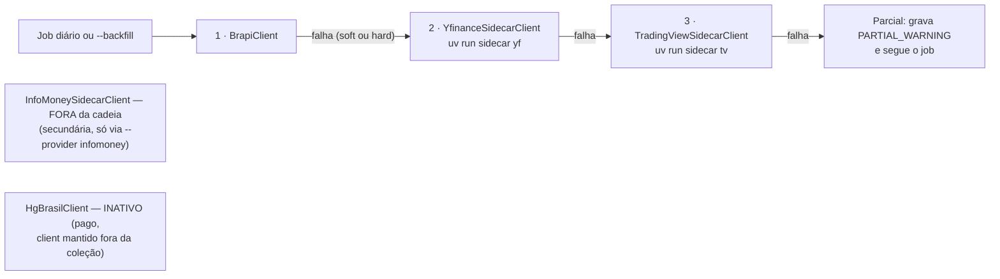
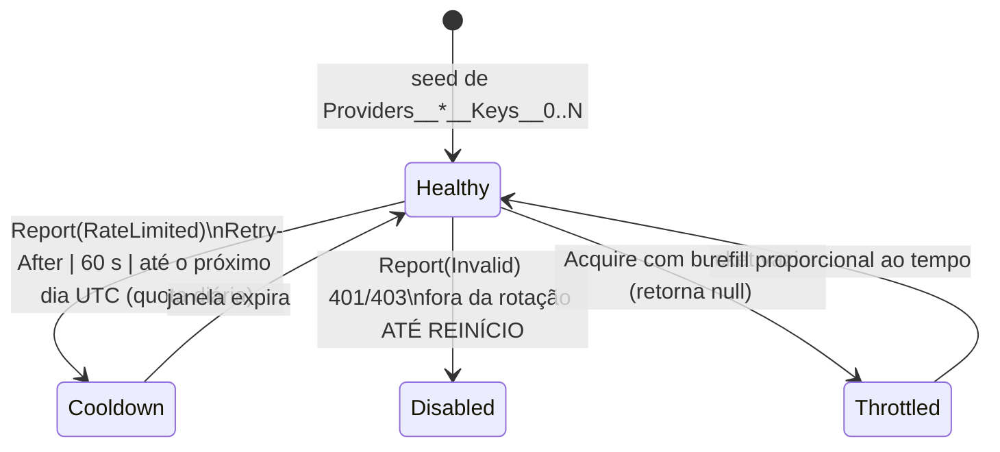

# IndexDesk.Modules.MarketData — Catálogo, Provedores & Ingestão (scoped)

> Companion to [`../../CLAUDE.md`](../../CLAUDE.md). Regras específicas deste módulo — o único que
> conhece provedores externos (a lógica mora aqui; os hosts são casca fina).
> Contexto geral: [`../../../CLAUDE.md`](../../../CLAUDE.md), [`../../../../../PROVIDERS.md`](../../../../../PROVIDERS.md)
> e plano da iniciativa em [`../../../../../plans/provider-sync-scrapers.md`](../../../../../plans/provider-sync-scrapers.md).
> **Do not modify code** when only instruction updates are requested.

## Mapa de pastas

| Pasta | Conteúdo |
| :--- | :--- |
| `Clients/` | Clientes de provedores: HTTP nativo (`BrapiClient`, `YahooFinanceClient`, `HgBrasilClient`, `BcbSeriesClient`, `AwesomeApiClient`) e **sidecar Python** (`YfinanceSidecarClient`, `TradingViewSidecarClient`, `InfoMoneySidecarClient`) + infra do processo (`SidecarProcessRunner`, `SidecarNdjson`) + HTTP anti-WAF (`ISidecarHttp`/`SidecarHttp`). Contrato comum: `IMarketDataClient` (`ProviderName`, `Priority`, `SupportsTicker`, quotes/dividends normalizados em `Result<T>`). |
| `Resilience/` | `IApiKeyPool`/`InMemoryApiKeyPool` (pool de chaves, singleton thread-safe) e `ProviderResilience` (retry + circuit breaker por provider, pipelines Polly cacheados). |
| `Ingestion/` | Serviços chamados pelos jobs Quartz: `DailyCloseSyncService`, `AssetSyncService` (legado do `/sync/daily` REST), `AssetBackfillService` (CLI/API backfill), `FxRateSyncService`, `TradingViewRefreshSyncService`, `MacroEconomicSyncService` (BCB). Planners puros extraídos p/ testabilidade: `DailyCloseChain` (status soft/hard), `DividendQueue` (fila espaçada), `SyncUniverse` (resolve tickers), `BenchmarkCatalog` (únicos tickers auto-criáveis como INDEX), `IngestionUpserts` (upserts idempotentes compartilhados), `SidecarProviderDirectory` (--provider explícito). Subpasta `Holdings/`: feeds + parsers das gestoras. |
| `Domain/` | Records normalizados (`NormalizedQuote`, `NormalizedDividend`, `NormalizedFxRate`), `Asset`, DTOs de query e de health. |
| `Pipeline/` | `MarketDataValidator` (sanidade de barras) e `FallbackMarketDataService` (caminha a cadeia `IMarketDataClient` por `Priority`). |
| `Services/` | Leitura: `AssetQueryService` (catálogo/rankings/performance/quotes/dividends/macro) e `ProviderHealthService`. |
| `Health/` | `ProviderHealthAggregator` — agregação pura sobre linhas de `sync_job_logs` (sem I/O, testável offline). |
| `Calculators/` | Funções puras sem I/O: `PerformanceCalculators`, `DividendCalculators` (mesma regra dos demais módulos). |

## Cadeia OHLCV declarativa

Registrada na DI como coleção `IMarketDataClient` ordenada por `Priority`
(`MarketDataModuleExtensions`, seção 3):



- **InfoMoney nunca entra no failover automático**: fonte secundária (preço cru, sem `adj_close`),
  alcançável apenas pelo caminho explícito (`SidecarProviderDirectory`, aliases
  `yahoo|yf|tv|tradingview|im|infomoney|brapi`).
- Yahoo/TV limitam **por IP** — lá vale espaçamento fixo (200 ms entre tickers no daily close) +
  breaker. Pool de chaves só se aplica a limite **por chave** (Brapi/AwesomeAPI/InfoMoney).
- Todo estágio grava a própria linha em `sync_job_logs`; falha de um provider **nunca** derruba os demais.

## Contrato NDJSON v1 (sidecar ⇄ C#)

O processo Python (`tools/providers/sidecar`, spawn via uv) emite **uma linha JSON por barra no
stdout**; logs e o envelope de erro `{"error":{"code":"..."}}` vão **somente ao stderr**. Exit codes:
`0` ok · `2` usage · `3` fetch · `4` parse. Parse/mapeamento vive em `Clients/SidecarNdjson.cs`;
uma linha malformada = `Sidecar.ParseError` (falha a chamada inteira — o Python valida antes de emitir).

```jsonc
// cotação (SidecarQuoteLine)                // dividendo (SidecarDividendLine)
{"ticker","date","open","high","low",        {"ticker","date","rate",
 "close","adj_close","volume"}                "type"}   // vocabulário B3 cru: DIVIDENDO, JRSCAPPROPRIO...
// date ISO-8601 YYYY-MM-DD; barras fora da janela pedida são descartadas (TV over-fetch)
```

- Dividendo carrega uma única data → `PaymentDate = ComDate` (fallback histórico do `YahooFinanceClient`).
- `adj_close` é obrigatório no contrato; fontes sem ajuste (InfoMoney) repetem `close`.

### Infra de processo (`SidecarProcessRunner`)

- Spawna `<UvPath> run --project <ProjectPath> sidecar <args>` (`ArgumentList`, segredos nunca em argv logado).
- Config: `Providers:Sidecar:UvPath` (default `uv`), `Providers:Sidecar:ProjectPath`
  (auto-resolvido subindo diretórios até achar `tools/providers/sidecar/pyproject.toml`),
  `Providers:Sidecar:TimeoutSeconds` (**default 120 s**; timeout mata a árvore de processos inteira).
- `MapFailure` traduz para códigos: `Sidecar.SpawnFailed` / `.Timeout` / `.Usage` / `.FetchFailed` /
  `.ParseError`; códigos específicos do envelope stderr (`TradingView.AuthFailed`,
  `Scrape.WafBlocked`...) têm precedência e são aplicados pelos clients.
- Segredos para o filho: cookie TV vai **no argv** (`Providers__TradingView__Cookie`), chave InfoMoney
  **no environment** (`INFOMONEY_SUBSCRIPTION_KEY` ← `Providers__InfoMoney__SubscriptionKeys__0`) —
  **opcional**: sem chave o spawn é keyless e o sidecar descobre a key pública do frontend sozinho.
- `SidecarHttp` (comando genérico `fetch --url [--method] [--data] [--header K: V] [--timeout-s] [--b64]`)
  = transporte anti-WAF (curl_cffi impersonate=chrome) para hosts que fazem TLS fingerprinting
  (medido: `www.itnow.com.br`). Feeds aderem por config — `Providers:Holdings:ItNow:Transport=sidecar|native`
  (default `sidecar`).

## Pool de chaves & breaker

### Ciclo de vida da chave (`IApiKeyPool` / `InMemoryApiKeyPool`)



- `Acquire(provider)` faz **round-robin só entre chaves saudáveis** e consome 1 token do bucket
  por chave (pacing DENTRO do pool — clientes ficam simples). Sem chave saudável → `null` e o caller
  cai pro próximo slot da cadeia (nunca erro duro).
- Config (binding padrão .NET): `Providers__Brapi__ApiKeys__0..N`, `Providers__AwesomeApi__Tokens__0..N`,
  `Providers__InfoMoney__SubscriptionKeys__0..N`. Chave única legada (`ApiKey`/`Token`/`SubscriptionKey`)
  liga como índice 0; provider **sem nenhuma chave roda keyless** (`HasKeys=false`, comportamento
  anônimo Brapi preservado).
- Bucket: `Providers:{Provider}:RequestsPerMinutePerKey` — Brapi free **10 req/min/chave**, demais 60.
- Observabilidade: `Snapshot()` expõe contadores **por índice** (`#{Index}`) — o valor da chave
  **nunca** aparece em log, métrica ou span OTel.

### Breaker por provider (`ProviderResilience`)

Singleton; pipelines cacheados por `(provider, T, modo)` — clients transient não perdem estado.
Modo `Http`: 2 retries exp+jitter (base 250 ms). Modo `Sidecar`: **1 retry só em**
`Sidecar.Timeout`/`Sidecar.FetchFailed`. Breaker: **5 falhas / janela 60 s → abre 30 s → half-open**.
Knobs em `Providers:Resilience:*` (`HttpMaxRetries`, `HttpRetryBaseDelayMs`, `SidecarMaxRetries`,
`BreakerFailures`, `BreakerSamplingSeconds`, `BreakerBreakSeconds`).

Taxonomia de error codes (quem sofre retry × quem conta pro breaker):

| Código | Retry | Conta breaker |
| :--- | :--- | :--- |
| `*.RateLimit` | sim (pool rotaciona chave) | não (cooldown do pool é o dono desse modo de falha) |
| `Scrape.WafBlocked`, `*.AuthFailed` | não (parede não sai a tiros) | sim |
| `*.HttpError`, `*.Exception`, `Sidecar.Timeout`, `Sidecar.FetchFailed` | sim | sim |
| `*.NoApiKey`, `*.NoData`, `*.NotFound`, `Provider.PoolExhausted`, `Sidecar.ParseError`, `Sidecar.Usage`, `Sidecar.SpawnFailed` | pass-through | pass-through |

Circuito aberto responde código **soft** `Provider.CircuitOpen`; pool esgotado responde
`Provider.PoolExhausted`. Ambos viram **PARTIAL_WARNING** (ver abaixo) e disparam failover — nunca
erro duro de job.

## Estágios de ingestão e status (`DailyCloseChain`)

Planner puro em `Ingestion/DailyCloseChain.cs`: `Provider.PoolExhausted`/`Provider.CircuitOpen` são
**soft failures** — degradam o estágio pra `PARTIAL_WARNING` mesmo com cobertura zero; erro hard com
cobertura zero = `FAILED`. `Overall`: um único estágio FAILED afunda o job; qualquer aviso degrada pra
PARTIAL_WARNING. `Providers:Brapi:DividendSpacingMs` (default **7000**) é resolvido aqui.
`DividendQueue` aplica o delay após **cada** ticker, inclusive o último (comportamento histórico preservado).

## Jobs que tocam este módulo

Os jobs vivem no Worker ([`../../IndexDesk.Worker/CLAUDE.md`](../../IndexDesk.Worker/CLAUDE.md));
os serviços são todos daqui. Fonte que falha isoladamente = **PARTIAL_WARNING** em `sync_job_logs`
e o job segue — fallback PARCIAL_WARNING é o desenhado, não um bug.

| Job | Cron (UTC) | Serviço do módulo |
| :--- | :--- | :--- |
| `BcbSyncJob` | `0 0 23 ? * * *` | `IMacroEconomicSyncService.SyncAllAsync` (SGS 12 CDI · 11 Selic · 433 IPCA · 189 IGP-M) |
| `MarketDataDailySyncJob` | `0 0 22 ? * MON-FRI *` | `IDailyCloseSyncService.SyncDailyCloseAsync` — 1 batch Brapi → fila proventos ≥7 s → gap fill Yahoo → TV |
| `FxRatesDailySyncJob` | `0 5 22 ? * MON-FRI *` | `IFxRateSyncService.SyncLatestAsync` — AwesomeAPI USD/EUR/BTC-BRL, `bid` = proxy de close em `fx_rates` |
| `TradingViewDailySyncJob` | `0 30 22 ? * MON-FRI *` | `ITradingViewRefreshSyncService.RefreshAsync` — universo: lista config (`Providers:Sync:TradingViewTickers`) ou séries defasadas (>4 dias) |
| `HoldingsWeeklySyncJob` | `0 0 8 ? * SAT *` | `IEtfHoldingsSyncService.SyncWeeklyAsync` — iShares CSV · SPDR XLSX · It Now JSON-first · Investo HTML → `etf_holdings` |
| `PilotAssetBackfillJob` | sem trigger (manual) | `IAssetBackfillService.BackfillPilotAssetsAsync` |

Backfill on-demand equivalente: `dotnet run --project src/IndexDesk.Worker -- --backfill TICKER [-p yahoo|tv|infomoney|brapi]`.
Universe de tickers (`SyncUniverse`): lista config explícita > ativos ativos não-INDEX > pilotos fixos.
Upserts compartilhados (`IngestionUpserts`): reexecutar o mesmo dia **atualiza, nunca duplica**.

## Holdings (`Ingestion/Holdings/`)

- Feeds (`HoldingsFeeds.cs`): `ISharesHoldingsFeed` (extrai link ajax do CSV da página do produto —
  hash **rotaciona**, regex aceita href absoluto e relativo), `SpdrHoldingsFeed`
  (`holdings-daily-us-en-{ticker}.xlsx` — ticker **minúsculo**, case-sensitive), `ItNowHoldingsFeed`
  (JSON `history-api-json` primeiro; `fundCode` resolvido da própria página por regex
  `fundo=([A-Z0-9]{6,})` com seed configurável `Providers:Holdings:ItNow:FundCodes:{TICKER}`;
  transporte sidecar por default), `InvestoHoldingsFeed` (HTML; publica **nomes sem ticker**).
- Parsers puros: `ISharesHoldingsParser`, `SpdrHoldingsParser`, `ItNowJsonParser`,
  `HtmlCompositionParser` (AngleSharp). Peso pt-BR: **vírgula decimal já é pontos percentuais**;
  fração só dot-only começando com `0.` (bug real de regressão — ver testes).
- Upsert dedupe por `(etf_asset_id, as_of_date, holding_ticker)`; linha sem ticker dedupe por nome;
  asset não curado = skip com warning (nunca fabricar asset).
- **Fixtures dos parsers:** `tests/IndexDesk.UnitTests/Fixtures/Holdings/` (CSV iShares, XLSX gerado
  in-memory nos testes, HTML It Now live-sample com distratores, JSON It Now, HTML Investo).
  Fixtures NDJSON do sidecar: flag `--fixture` do próprio CLI + scripts fake nos testes C#
  (`tests/IndexDesk.UnitTests/MarketData/SidecarClientsTests.cs`). Suíte do sidecar (pytest) é offline.

## Endpoints expostos

Grupo `/api/v1/assets` (`MarketData` tags): gatilhos manuais de sync/backfill/macro (`POST /sync/daily`,
`/sync/backfill`, `/sync/macro` — caminho operacional legado; o fluxo agendado usa `IDailyCloseSyncService`),
catálogo paginado, `/rankings` (métricas whitelistadas em `RankingMetrics`), `/{ticker}/performance`,
`/{ticker}/quotes`, `/{ticker}/dividends`, `/market-indicators`, `/macro-series`, `/quotes/batch`.
Grupo `/api/v1/providers`: `GET /health` (agrega `sync_job_logs` + snapshot do pool de chaves).

## Regras fixas

- **Local-first:** nenhum método daqui roda no request path de usuário chamando provedor externo —
  só jobs do Worker e os gatilhos operacionais acima.
- Escrita idempotente sempre (`IngestionUpserts`); hypertables: coluna `date` na PK composta.
- Falha isolada de provider degrada (`PARTIAL_WARNING`); nunca interromper os demais estágios.
- Segredos só via config/env (`Providers__*`); nada commitado em `appsettings.json` além de defaults dev;
  nunca logar valor de chave/token/cookie (índice `#{Index}` no máximo).
- DI: singletons = `TimeProvider`, `IApiKeyPool`, `ProviderResilience`, `SidecarProcessRunner`,
  `ISidecarHttp`, `MarketDataValidator`; typed `AddHttpClient` para clients nativos; serviços de
  ingestão/query scoped; clients sidecar transient como tipos concretos + 3 entradas na coleção
  `IMarketDataClient`.
