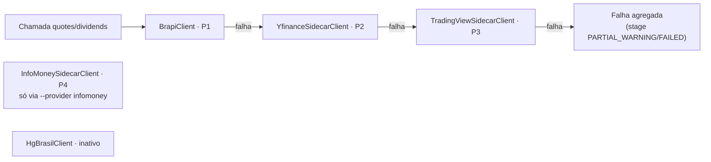

# MarketData/Clients — Clientes de provedores externos (scoped)

> Companion to [`../CLAUDE.md`](../CLAUDE.md). Este doc detalha o que o mapa de pastas do módulo resume para `Clients/`.
> Orçamentos, TTLs e rate limits por provider: [`../../../../../../PROVIDERS.md`](../../../../../../PROVIDERS.md).

## Responsabilidade

Única camada que conhece a forma crua das APIs externas (HTTP nativo ou processo Python sidecar) e
normaliza tudo para os records de `Domain/` em `Result<T>`; nada de persistência ou `sync_job_logs`
aqui — isso é `Ingestion/`.

## Inventário

### Contrato comum

- `IMarketDataClient.cs` — `ProviderName`, `Priority` (1 = primário), `SupportsTicker(ticker)`,
  `GetHistoricalQuotesAsync`, `GetDividendsAsync`. Registrados como coleção ordenada por `Priority`.
- `IBcbSeriesClient.cs` — contrato separado (fora da cadeia OHLCV): códigos SGS fixos
  (CDI 12, Selic 11, IPCA 433, IGP-M 189) + record `BcbSeriesPoint`.
### HTTP nativo (typed `AddHttpClient`)
- `BrapiClient.cs` — Priority 1. Um único batch diário `/quote/list` para toda a B3 (orçamento free plan);
  respostas anônimas podem ignorar o filtro `tickers` → filtragem client-side. Chaves via pool
  (`Providers__Brapi__ApiKeys__0..N`, keyless = anônimo preservado).
- `YahooFinanceClient.cs` — Priority 2 nativo (chart API, símbolos `.SA`/benchmark); referência histórica e
  origem do fallback `PaymentDate = ComDate` — slot Yahoo ativo na cadeia é o sidecar.
- `HgBrasilClient.cs` — Priority 3, **INATIVO**: pago, fora da coleção DI; código preservado como contingência.
- `AwesomeApiClient.cs` / `IAwesomeApiClient` — FX (USD/EUR/BTC-BRL); `bid` = proxy de close;
  tokens do pool (`Providers__AwesomeApi__Tokens__0..N`) como query param, nunca logados.

### Sidecar Python (spawn uv, transient)

- `YfinanceSidecarClient.cs` — Priority 2 (`sidecar yf ...`); normalização `.SA` dentro do Python.
- `TradingViewSidecarClient.cs` — Priority 3 (`sidecar tv history ...`, `BMFBOVESPA:`); cookie opcional
  `Providers:TradingView:Cookie` vai ao argv do filho apenas; `MinBars 5` / `MaxBars 5000`;
  auth falha vira `TradingView.AuthFailed`.
- `InfoMoneySidecarClient.cs` — Priority 4, **FORA do failover automático** (fonte secundária de validação
  cruzada, preço cru sem ajuste); Akamai + APIM: chave do pool injetada via env `INFOMONEY_SUBSCRIPTION_KEY`;
  `Scrape.WafBlocked` conta pro breaker.

### Infra de transporte

- `SidecarProcessRunner.cs` — spawn `<UvPath> run --project <ProjectPath> sidecar <args>`; contrato
  NDJSON (stdout = dados, stderr = logs + envelope `{"error":{...}}`; exit 0/2/3/4); timeout default
  **120 s** mata a árvore; segredos nunca aparecem em log.
- `SidecarNdjson.cs` — parse tolerante a linhas vazias, mas linha malformada = falha da chamada
  (`Sidecar.ParseError`); descarta barras fora da janela pedida (over-fetch TV/InfoMoney).
- `ISidecarHttp.cs` / `SidecarHttp.cs` — HTTP anti-WAF pelo comando `fetch` do sidecar (curl_cffi
  impersonate=chrome) para hosts com TLS fingerprinting; falhas carregam o error code verbatim.

## Cadeia declarada (failover por `Priority`)

## Regras locais

- **Nunca chamar provider fora do Worker/backfill operacional** — request path de usuário é proibido (local-first).
- Todo client retorna `Result<T>` e aplica retry/breaker internamente via
  `Resilience/ProviderResilience.ExecuteAsync`; exceção crua vira `{Provider}.Exception` — caller nunca envolve client em Polly próprio.
- Limite **por chave** (Brapi/AwesomeAPI/InfoMoney): `IApiKeyPool.Acquire/Report`; limite **por IP**
  (Yahoo/TV sidecar): espaçamento fixo upstream + breaker, sem pool.
- `SupportsTicker` é filtro barato e síncrono — benchmarks (`^`, `=`, `BenchmarkCatalog`) não vão pra Brapi/HG.
- Segredos só por config/env; log identifica chave por índice (`#{Index}`), jamais pelo valor.
- Novo provedor: implementar `IMarketDataClient`, definir `Priority`, registrar na coleção DI (`MarketDataModuleExtensions`) e documentar orçamento no `PROVIDERS.md`.