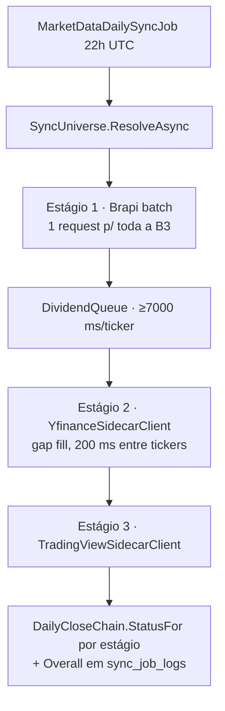

# MarketData/Ingestion — Serviços e planners de ingestão (scoped)

> Companion to [`../CLAUDE.md`](../CLAUDE.md). Este doc detalha o que o mapa de pastas do módulo resume para `Ingestion/`.
> Jobs Quartz que chamam estes serviços: [`../../../IndexDesk.Worker/CLAUDE.md`](../../../IndexDesk.Worker/CLAUDE.md).

## Responsabilidade

Camada orquestradora entre os jobs agendados (Worker) e os clients de `Clients/`: resolve o universo
de tickers, executa as cadeias de fallback, aplica rate-limit/espaçamento e persiste via upserts
idempotentes. Subpasta dedicada: [`Holdings/`](Holdings/CLAUDE.md).

## Inventário — serviços (scoped, um por job)

- `IDailyCloseSyncService.cs` / `DailyCloseSyncService.cs` — pipeline diário pós-fechamento:
  1 batch Brapi → fila espaçada de proventos → gap fill Yahoo → TV. Cada estágio grava a própria linha
  em `sync_job_logs`; falha isolada nunca aborta os demais. Parâmetro `targetDate` opcional: quando
  setado para dia passado (catch-up do bootstrap), **pula batch Brapi + fila de proventos** (Brapi free
  só expõe "hoje") e roda só Yahoo → TV para aquela data — estágios Brapi aparecem como `SUCCESS`
  zerado em `sync_job_logs` (skip intencional, não erro).
- `IAssetSyncService.cs` / `AssetSyncService.cs` — legado do gatilho REST `POST /sync/daily`;
  pilotos fixos + invalidação de cache.
- `IAssetBackfillService.cs` / `AssetBackfillService.cs` — backfill histórico (job manual e CLI
  `--backfill TICKER [-p ...]`); datas iniciais sob medida por ativo piloto.
- `IFxRateSyncService.cs` / `FxRateSyncService.cs` — AwesomeAPI USD/EUR/BTC-BRL às 22:05 UTC;
  `bid` = proxy de close em `fx_rates`.
- `ITradingViewRefreshSyncService.cs` / `TradingViewRefreshSyncService.cs` — refresh 22:30 UTC,
  janela 30 dias; universo = config ou detecção de defasagem (>4 dias cobre fim de semana + feriado).
- `IMacroEconomicSyncService.cs` / `MacroEconomicSyncService.cs` — BCB SGS (CDI/Selic/IPCA) às 23:00 UTC.

## Inventário — planners puros (testáveis sem banco)

- `DailyCloseChain.cs` — status soft/hard: `Provider.PoolExhausted`/`Provider.CircuitOpen` são falhas
  **soft** (estágio vira `PARTIAL_WARNING` mesmo com cobertura zero); erro hard com cobertura zero =
  `FAILED`. Também resolve `Providers:Brapi:DividendSpacingMs` (default **7000**).
- `DividendQueue.cs` — fila espaçada de proventos Brapi: delay após **cada** ticker, inclusive o último;
  classifica soft/hard e devolve `DividendQueueOutcome`.
- `SyncUniverse.cs` — resolução de universo: lista config explícita > ativos ativos não-benchmark >
  pilotos (`MXRF11`, `VWRA11`, `GOLD11`, `WRLD11`). Chaves: `Providers:Sync:{DailyTickers,TradingViewTickers}`.
- `BenchmarkCatalog.cs` — únicos tickers auto-criáveis como INDEX (`IBOV` com histórico desde 2015 via
  `^BVSP`; `IFIX` forward-only, Yahoo só expõe nível atual). Demais ativos exigem curadoria explícita.
- `IngestionUpserts.cs` — upserts compartilhados idempotentes (quotes/dividends/FX): reexecutar o mesmo
  dia atualiza in place, nunca duplica.
- `SidecarProviderDirectory.cs` — alvos de `--provider` explícito; aliases canônicos
  `brapi|b3|yahoo|yf|yahoosidecar|tv|tradingview|infomoney|im`; InfoMoney só é alcançável aqui.

## Fluxo do daily close

## MarketData/Ingestion — serviços (adições da fase Sync Bootstrap)

- `BusinessDayCalculator.cs` — puro, sem I/O: `IsBusinessDay`, `PreviousBusinessDay`,
  `BusinessDaysBetween(from, to)`. Feriado = `HashSet<DateOnly>`; tabela vazia degrada pra
  filtro só de fim de semana. Testado em `BusinessDayCalculatorTests` (13 casos).
- `MarketHolidayQueries.cs` — adaptadores I/O de `market_holidays`:
  `GetLatestBusinessDayOnOrBeforeAsync` / `GetBusinessDaysBetweenAsync` (1 round trip, `AsNoTracking`,
  filtra `Exchange = 'B3'`).

## Regras locais

- Toda escrita passa por `IngestionUpserts`; PK composta das hypertables inclui `date`.
- Falha de um estágio degrada (`PARTIAL_WARNING`) — nunca derruba os demais; `Overall`: um FAILED afunda o job.
- Espaçamento obrigatório onde há limite por IP (200 ms Yahoo/TV) e no queue de proventos (≥7 s Brapi).
- Ticker desconhecido é skip com warning — jamais criar asset fora de `BenchmarkCatalog`.
- Planners novos: extrair como classe pura estática aqui, delegando I/O por delegate/injeção.
