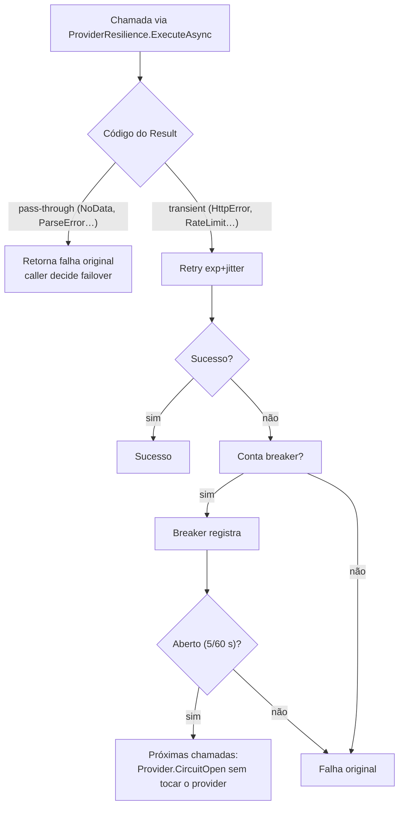

# MarketData/Resilience — Pool de chaves e circuit breaker (scoped)

> Companion to [`../CLAUDE.md`](../CLAUDE.md). Este doc detalha o que o mapa de pastas do módulo resume para `Resilience/`.
> Pipelines Polly compartilhados vivem em `BuildingBlocks.Resilience`; aqui está a política específica de providers.

## Responsabilidade

Duas peças complementares de proteção aos provedores externos: rotação/pacing de chaves de API
(limite **por chave**) e retry + circuit breaker por provider (aplicados sobre códigos de erro
taxonomizados em `Result<T>`).

## Inventário

- `IApiKeyPool.cs` — contrato do pool: `Acquire(provider)`, `Report(provider, key, KeyResult, retryAfter?)`,
  `HasKeys(provider)`, `Snapshot()`; enum `KeyResult` (`Success` / `RateLimited` / `Invalid`);
  record `ProviderKeyStats` identificado por índice.
- `InMemoryApiKeyPool.cs` — singleton thread-safe (Worker = 1 instância; scale-out migraria contadores
  p/ Redis): round-robin só entre chaves saudáveis, token bucket por chave (pacing dentro do pool),
  cooldown pós-429 (Retry-After | 60 s | até o próximo dia UTC em quota diária), disable até reinício
  pós-401/403, refill proporcional ao tempo. Defaults: Brapi free **10 req/min/chave**, demais 60.
  Providers sem chave rodam keyless (`HasKeys=false`) — comportamento anônimo Brapi preservado.
- `ProviderResilience.cs` — singleton; pipelines cacheados por `(provider, Type, ProviderMode)`
  (`Http` ou `Sidecar`). Modo Http: 2 retries exp+jitter base 250 ms. Modo Sidecar: 1 retry somente
  em `Sidecar.Timeout`/`Sidecar.FetchFailed`. Breaker: 5 falhas / janela 60 s → abre 30 s → half-open.
  Knobs em `Providers:Resilience:*`. Classe interna `ProviderCallException` carrega o error code original
  através do Polly; circuito aberto responde soft `Provider.CircuitOpen` (nunca lança).

## Taxonomia de error codes

| Código | Retry | Conta breaker |
| :--- | :--- | :--- |
| `*.RateLimit` | sim (pool rotaciona) | não (cooldown do pool é dono) |
| `Scrape.WafBlocked`, `*.AuthFailed` | não | sim |
| `*.HttpError`, `*.Exception`, `Sidecar.Timeout`, `Sidecar.FetchFailed` | sim | sim |
| `*.NoApiKey`, `*.NoData`, `*.NotFound`, `Provider.PoolExhausted`, `Sidecar.ParseError`, `Sidecar.Usage`, `Sidecar.SpawnFailed` | pass-through | pass-through |

## Decisão retry × breaker × failover

## Regras locais

- `RateLimit` **nunca** abre o breaker — cooldown do pool é o dono desse modo de falha.
- Pool esgotado (`Acquire == null`) responde `Provider.PoolExhausted` no client; ambos os soft codes
  disparam failover e viram PARTIAL_WARNING downstream (`Ingestion/DailyCloseChain`).
- Observabilidade do pool só por índice (`#{Index}`): valor de chave/token jamais em log, métrica ou span OTel.
- Novo provider com limite por chave: adicionar entrada em `KnownProviders` do pool
  (array key + legacy key) em vez de ler config direto no client.
