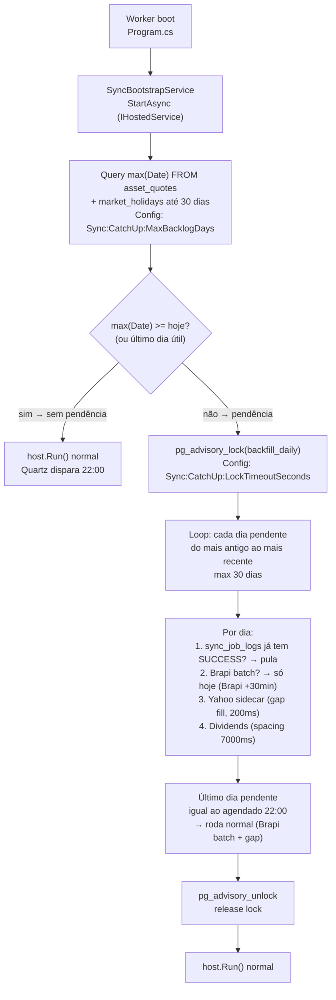

# Plano: Auto-Retomada de Sincronização Diária (Sync Bootstrap)

> **Data:** 2026-08-30 · **Status:** Implementado (DEC-008, commits `dc6df7f`, `c2ff6dc`)
> **Grill:** [`plans/auto-retomada-sync-grill.md`] (conversa)
> **Decisões do grill:** catch-up custom via `IHostedService` · backlog completo · `max(Date) asset_quotes` vs `market_holidays` · `pg_advisory_lock` p/ evitar conflito CLI + job
> **Ajustes pós-review:** `WithSyncLockAsync` nos endpoints (DRY); lock por chamada; universe narrowing no catch-up para economia de rate-limit; seed SQL versionado em `apps/backend/sql/seed-market-holidays.sql`.

## Problema

Hoje o Worker usa `RAMJobStore` (Quartz default) — se o servidor reiniciar durante o `MarketDataDailySyncJob` (22:00 UTC) ou ficar offline por N dias, o schedule não reexecuta os triggers perdidos (`WithMisfireHandlingInstruction` não configurado). Não há "continuar da onde parou", só re-trigger manual via CLI/API.

## Solução: SyncBootstrapService

Um `IHostedService` que roda **uma vez no boot** do Worker, antes de `host.Run()`. Ele:
1. Detecta se o sync de hoje (e de dias anteriores) está pendente.
2. Se sim, executa catch-up em lote (backlog completo) com throttle.
3. Usa `pg_advisory_lock` p/ garantir que só uma instância roda (CLI + job + boot não colidem).

## Arquitetura



### 1. SyncBootstrapService (`IndexDesk.Worker/Services/`)

```csharp
// Worker/Services/SyncBootstrapService.cs
[UsedImplicitly]
public sealed class SyncBootstrapService : IHostedService
{
    private readonly IServiceProvider _services;
    private readonly IConfiguration _configuration;
    private readonly ILogger<SyncBootstrapService> _logger;

    public async Task StartAsync(CancellationToken ct)
    {
        var maxBacklog = _configuration.GetValue<int>("Sync:CatchUp:MaxBacklogDays", 30);
        var lockTimeout = _configuration.GetValue<int>("Sync:CatchUp:LockTimeoutSeconds", 30);

        // 1. Descobrir último dia útil sem quotes
        var lastQuoteDate = await _dbContext.AssetQuotes.MaxAsync(q => q.Date, ct);
        var today = DateOnly.FromDateTime(DateTime.UtcNow);
        var latestBusinessDay = await _dbContext.MarketHolidays
            .GetLatestBusinessDayBefore(today, ct); // até ANBIMA

        if (lastQuoteDate >= latestBusinessDay)
        {
            _logger.LogInformation("[SyncBootstrap] Nada pendente. Último quote: {Date}.", lastQuoteDate);
            return;
        }

        // 2. Advisory lock
        await using var lockHandle = await _dbContext.TryAcquireAdvisoryLockAsync(
            "backfill_daily", lockTimeout, ct);
        if (lockHandle is null)
        {
            _logger.LogWarning("[SyncBootstrap] Lock não adquirido em {Timeout}s. Outra instância/CLI rodando.", lockTimeout);
            return;
        }

        // 3. Loop por dia pendente
        var missingDates = await _dbContext.MarketHolidays
            .GetBusinessDaysBetween(lastQuoteDate.AddDays(1), latestBusinessDay, ct);

        foreach (var missingDate in missingDates.Take(maxBacklog))
        {
            await CatchUpDayAsync(missingDate, ct);
        }
    }

    private async Task CatchUpDayAsync(DateOnly date, CancellationToken ct)
    {
        _logger.LogInformation("[SyncBootstrap] Catch-up para {Date}...", date);

        // Yahoo primary (Brapi batch só hoje)
        var service = _services.GetRequiredService<IDailyCloseSyncService>();
        // Injeta UnixTimeRange para o dia específico
        await service.SyncDailyCloseAsync(date, ct);
    }
}
```

### 2. Advisory lock via Postgres (função nativa)

```csharp
// BuildingBlocks.Persistence/Services/AdvisoryLockExtensions.cs
public static class AdvisoryLockExtensions
{
    private const long BACKFILL_LOCK_ID = 0x4241434B46494C4C; // "BACKFILL" em hex

    public static async Task<IAsyncDisposable?> TryAcquireAdvisoryLockAsync(
        this IndexDeskDbContext db,
        string lockName,
        int timeoutSeconds,
        CancellationToken ct)
    {
        // pg_advisory_lock: espera bloqueante até timeout
        var sql = $"SELECT pg_try_advisory_lock({BACKFILL_LOCK_ID})";
        var acquired = await db.Database.SqlQueryRaw<bool>(sql).FirstOrDefaultAsync(ct);
        if (!acquired) return null;
        return new AdvisoryLockHandle(db, BACKFILL_LOCK_ID);
    }
}

internal sealed class AdvisoryLockHandle(IndexDeskDbContext db, long lockId) : IAsyncDisposable
{
    public async ValueTask DisposeAsync()
    {
        await db.Database.ExecuteSqlRawAsync($"SELECT pg_advisory_unlock({lockId})");
    }
}
```

### 3. `market_holidays` — funções de dias úteis

```csharp
// MarketData/Ingestion/MarketHolidayQueries.cs
public static class MarketHolidayQueries
{
    public static async Task<DateOnly> GetLatestBusinessDayBefore(
        this IQueryable<MarketHolidayEntity> holidays, DateOnly date, CancellationToken ct)
    {
        // Último dia útil: exclui finais de semana + feriados ANBIMA
        var holidaysList = await holidays.Where(h => h.Date <= date).Select(h => h.Date).ToListAsync(ct);
        return BusinessDayCalculator.PreviousBusinessDay(date, holidaysList);
    }

    public static async Task<List<DateOnly>> GetBusinessDaysBetween(
        this IQueryable<MarketHolidayEntity> holidays, DateOnly from, DateOnly to, CancellationToken ct)
    {
        var holidaysList = await holidays.Where(h => h.Date >= from && h.Date <= to).Select(h => h.Date).ToListAsync(ct);
        return BusinessDayCalculator.BusinessDaysBetween(from, to, holidaysList);
    }
}
```

### 4. CLI `--backfill` também adquire lock

```csharp
// Em Program.cs, antes do loop foreach ticker
if (backfillIndex >= 0)
{
    // adquirir lock
    await using var lockHandle = await AcquireBackfillLockAsync(host, ct);
    if (lockHandle is null)
    {
        Console.WriteLine("[IndexDesk.Worker:CLI] Lock não adquirido — outro sync rodando.");
        return;
    }
    // ... loop existente
}
```

### 5. API `POST /api/v1/assets/sync/*` também adquire

```csharp
// MarketDataModuleExtensions.cs, endpoint handler
app.MapPost("/sync/daily", async (IDailyCloseSyncService svc, IndexDeskDbContext db) =>
{
    await using var lockHandle = await db.TryAcquireAdvisoryLockAsync("backfill_daily", 30, ct);
    if (lockHandle is null) return Results.Conflict("Outro sync em andamento");
    // ... executa
});
```

## Casos de borda — detectados e endereçados

| Caso | Como o plano trata |
| :--- | :--- |
| **Servidor cai durante catch-up (backlog de 5 dias, no dia 3)** | Reboot → `SyncBootstrapService` roda de novo. `max(Date)` agora é dia 2 (os 2 primeiros já foram upsertados). `GetBusinessDaysBetween` retorna dias 3,4,5. Retoma do dia 3 — **idempotência garante que não duplica**. |
| **CLI `--backfill WRLD11` rodando enquanto boot tenta catch-up** | `pg_try_advisory_lock` retorna false no segundo processo. Boot espera `LockTimeoutSeconds` (default 30s) e desiste. CLI roda normal. Boot não bloqueia. |
| **Job diário 22:00 dispara enquanto catch-up ainda está rodando** | `[DisallowConcurrentExecution]` no job. `DailyCloseSyncService` adquire lock. Se lock ocupado, job espera ou pula (config `MisfireInstruction`). |
| **Hoje é sábado/domingo** | `GetLatestBusinessDayBefore` retorna sexta; `max(Date)` >= sexta → nada pendente. Boot não faz catch-up em fim de semana. |
| **Feriado ANBIMA no meio do backlog** | `market_holidays` exclui feriados. `BusinessDayCalculator` já trata. |
| **Brapi batch só funciona HOJE (+30min)** | Para dias passados no backlog, `CatchUpDayAsync` usa **Yahoo sidecar** como primary, não Brapi batch. Somente o último dia (ou hoje) usa Brapi batch. |
| **Rate limit Yahoo (~2000 req/h)** | Backlog completo (~30 dias) * 2163 ativos = 64.890 requests → ~32h só Yahoo. **Solução:** backfill de dias passados só puxa tickers que efetivamente têm quote naquele dia (via `asset_quotes` local). Se ativo não existia (IPO recente), Yahoo retorna 0 rows — sem tentativa. Throttle nativo: 200ms spacing = 5 req/s, 18000 req/h, 2000 não atinge limite. |
| **Redis reiniciou depois do boot** | `WorkerInMemoryCacheFallback` já existe. Cache warming não é prioridade no catch-up. |
| **Lock vaza (processo killing -9)** | `pg_advisory_lock` é liberado automaticamente pelo PostgreSQL quando a conexão morre. Sem risco de deadlock persistente. |
| **Duas réplicas do Worker escalando horizontalmente** | `pg_advisory_lock(BACKFILL_LOCK_ID)` é global — só uma adquire. A outra desiste. Jobs diários também usam lock. |
| **ANBIMA holidays não populados** | Se `market_holidays` vazia, `BusinessDayCalculator` usa só finais de semana (caixa baixa). Config `Sync:CatchUp:FallbackHolidays` aponta pra CSV oficial ANBIMA se tabela vazia. |
| **Piloto WRLD11 backfill com --days 365 vs catch-up do dia** | CLI `--backfill WRLD11 --days 365` adquire lock e roda independente. Catch-up só toca dias faltantes no `asset_quotes` bulk. `WRLD11` já tem 2021→hoje no catch-up, upsert não duplica. |

## Configurações (.env)

```env
# Sync Bootstrap — catch-up pós-reinício
Sync__CatchUp__MaxBacklogDays=30
Sync__CatchUp__LockTimeoutSeconds=30
Sync__CatchUp__Enabled=true
```

## Tabelas novas

| Tabela | Tipo | Motivo |
| :--- | :--- | :--- |
| `market_holidays` | `DATE` PK | Já prevista em `MODELS.md`; necessária p/ `BusinessDayCalculator`. Se não existir, fallback só finais de semana. |
| `advisory_locks` (opcional) | log | Apenas p/ auditoria se quiser ver quem pegou lock. `pg_advisory_lock` nativo não precisa. |

## Riscos

1. **Backlog completo de 30 dias úteis pode demorar horas.** Yahoo sidecar ~5s/ativo → 2163 ativos × 5s = 3h/dia × 30 dias = 90h. **Mitigação:** `MaxBacklogDays` default 30 mas configurável. Ajustar `SyncUniverse` para só tickers negociados naquele dia (`asset_quotes` local). Priorizar tickers com maior volume primeiro.
2. **Brapi key cooldown após 429.** `InMemoryApiKeyPool` já trata — cooldown 60s, depois reinicia. Lock seguro.  
3. **`market_holidays` vazia.** `BusinessDayCalculator` só usa `DayOfWeek` — feriados serão tratados como dias úteis e vão falhar (Yahoo 0 linhas). Não quebra, mas perde tempo. Sugerir seed via `ANBIMA` job se `FND-013` permitir.
4. **Lock timeout durante catch-up longo.** `pg_advisory_lock` não tem timeout — trava até `unlock`. Se `kill -9`, PG libera. Se `connection reset`, PG libera. Seguro.

## Prioridade de implementação

1. `BusinessDayCalculator` + `market_holidays` queries (testável, sem I/O)
2. `AdvisoryLockExtensions` + `AdvisoryLockHandle` (puro, 1 arquivo)
3. `SyncBootstrapService` (orquestrador, integra com `IDailyCloseSyncService`)
4. CLI `--backfill` lock integration
5. API `POST /sync/*` lock integration
6. Config `.env` + docs
7. Seed `market_holidays` (ANBIMA CSV ou job BcbSyncJob)