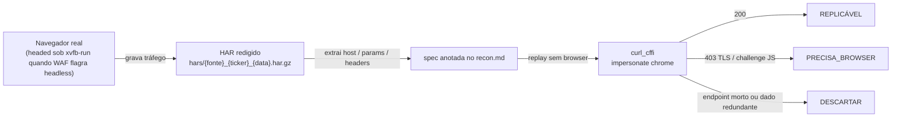

# tools/providers/recon/ — Recon de fontes externas

Artefatos da **Fase 0.5** da iniciativa provider-sync (plano:
[`plans/provider-sync-scrapers.md`](../../../plans/provider-sync-scrapers.md)): investigação de
endpoints privados de sites de gestoras/portais para transformá-los em spec replicável. É trabalho de
**recon one-time**, re-executado quando uma fonte quebra ou entra na pauta — nunca roda em produção.

## O que mora aqui

| Caminho | Papel |
| :--- | :--- |
| [`recon.md`](recon.md) | **Inventário canônico** — spec por fonte: hosts, endpoints, headers, contratos, classificação com evidência e data |
| [`hars/`](hars/README.md) | HARs brutos capturados (gzip, date-suffixed) + convenção de captura/redação |

Regra de verdade: **`recon.md` é a fonte da verdade; os HARs são evidência bruta**. Conclusão nova só
existe depois de registrada no `recon.md` — HAR sem análise documentada não vale como spec.

## Classificações (vocabulário fixo)

- **REPLICÁVEL** — replay via `curl_cffi impersonate="chrome"` retorna 200 sem browser.
- **PRECISA_BROWSER** — endpoint só se revela/exige JS real ou HAR (challenge, SPA shell).
- **DESCARTAR** — endpoint morto, dado redundante ou custo maior que o benefício.

Toda mudança de veredito vai na tabela "Resumo das classificações" do `recon.md`, com evidência e data.

## Como capturar um HAR novo

Ambiente: Python + Playwright (`uv venv && uv pip install curl-cffi==0.16.1 playwright && playwright
install chromium`; deps de sistema via `playwright install-deps chromium`).

1. Um **contexto novo por site** (`record_har_path`, modo full), viewport 1366×900, `locale=pt-BR`.
2. Navegar até `wait_until="domcontentloaded"` + esperar ≥ 10 s + scroll para lazy-load.
3. **WAF flagra headless**: XP Asset, It Now e Investing.com devolvem 403 "Acesso Bloqueado" ao UA
   `HeadlessChrome`. Nesses casos capturar **headed sob xvfb**:

   ```bash
   xvfb-run -a python capture_headed.py   # launch(headless=False)
   ```

   InfoMoney, BlackRock e Invesco-US funcionam até headless.
4. Salvar em `hars/{fonte}_{ticker}_{YYYY-MM-DD}.har.gz` (gzip porque passam de ~5 MB), seguindo o
   padrão dos arquivos existentes.
5. **Redigir segredos antes de salvar** (seção abaixo) e re-checar leaks antes do commit.

Os scripts usados na rodada original ficaram em scratch (`/tmp/opencode/recon2/`) e não são versionados —
a convenção acima basta para recriá-los.

## Como re-classificar uma fonte

1. Reabra o HAR (ou navegue de novo) e liste os XHRs candidatos.
2. Reproduza cada endpoint **sem browser** via curl_cffi (exemplos abaixo). Timeout ≤ 20 s por chamada,
   sempre `impersonate="chrome"` quando houver Akamai/Cloudflare no caminho.
3. Compare payload com o contrato anotado no `recon.md`.
4. Atualize `recon.md`: tabela de classificações + subseção da fonte (endpoints novos, rotas mortas,
   hash/parâmetro que rotacionou). Cite status HTTP e tamanho/payload observado como evidência.

## Replay via curl_cffi — exemplos

```python
from curl_cffi import requests

# InfoMoney — exige chave APIM (.env Providers__InfoMoney__SubscriptionKeys__0); sem chave = 403 Akamai
r = requests.get(
    "https://api-infomoney.xpi.com.br/infomoney-services-marketdata/v1/api/v1/"
    "b3/quotes/daily/MGLU3?Page=1&PageSize=5&Order=Desc",
    headers={
        "ocp-apim-subscription-key": KEY,
        "Origin": "https://www.infomoney.com.br",
        "Referer": "https://www.infomoney.com.br/",
        "Accept": "application/json",
    },
    impersonate="chrome",
    timeout=20,
)

# It Now (Itaú Asset) — POST sem auth; fundo = código tipo-ISIN, não ticker
r = requests.post(
    "https://www.itnow.com.br/history-api-json/",
    params={"type": "composicoes-indices", "fundo": "BRBOVVCTF009"},
    headers={
        "Origin": "https://www.itnow.com.br",
        "Referer": "https://www.itnow.com.br/bovv11/composicao/",
    },
    impersonate="chrome",
    timeout=20,
)

# XP Asset — wp-json estruturado (holdings/cotas); WAF TLS: curl puro = 403
r = requests.get(
    "https://www.xpasset.com.br/wp-json/composicao_carteira/v1/etf/XINA11",
    impersonate="chrome",
    timeout=20,
)

# AwesomeAPI — sem WAF e sem chave; curl puro resolve (impersonate desnecessário)
r = requests.get(
    "https://economia.awesomeapi.com.br/json/daily/USD-BRL?start_date=20260801&end_date=20260823",
    timeout=20,
)
```

Chaves vêm de `.env` (`Providers__*`) — nunca de código, commit ou exemplo com valor real.

## Redação de segredos nos HARs

Todo HAR passa por redação automatizada antes de entrar em `hars/`: valores do header
`ocp-apim-subscription-key` e ocorrências da chave marketdata do InfoMoney em bodies/postData são
substituídos pelo formato **`9d461117...REDACTED...e4695`** (prefixo/sufixo preservados para conferência,
centro removido). Cookies de sessões anônimas descartáveis permanecem como capturados. Antes de commitar
HAR novo: grep pelo valor completo da chave e por padrões de token no arquivo.

## Fluxo resumido



Veredito atualizado no `recon.md` alimenta os clients das fases seguintes do plano (sidecar `curl_cffi`,
C# nativo ou fora da cadeia).
